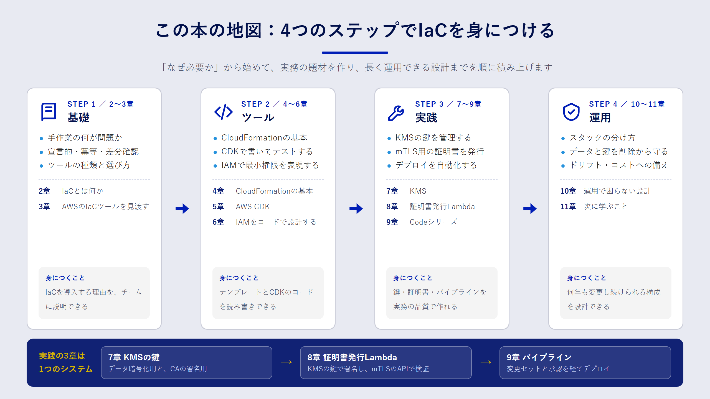

## この章で分かること

- この本がどんな読者を想定し、何を持ち帰ってもらいたいのか
- 全11章がどうつながっているのか
- サンプルコードを動かすのに必要なものと、動かすときの注意点

## この本が目指すこと

AWS のマネジメントコンソールは、初めてサービスを触るときには心強い道具です。画面の案内に沿って進めれば、数分で S3 バケットや Lambda 関数ができあがります。

ところが、同じ構成を検証環境と本番環境の二つに作る段階になると、話が変わります。「あのときチェックを入れた項目はどれだったか」「本番だけ暗号化の設定が違う理由は誰が知っているのか」。こうした疑問に、コンソールの操作履歴は答えてくれません。

Infrastructure as Code（IaC）は、インフラの構成をコードとして書き、そのコードからリソースを作る考え方です。コードはレビューでき、履歴が残り、同じものを何度でも再現できます。この本のゴールは、読者のみなさんが **「自分のチームの AWS 環境を、自信を持ってコードで管理できる」** 状態になることです。

そのために、ツールの使い方だけでなく、次の二つを重視しています。

1. **なぜその書き方をするのか**。たとえば KMS のキーポリシーで管理者と利用者を分ける理由を、事故の例と一緒に説明します。
2. **実務でそのまま応用できる題材**。手順書に載りがちな「Hello World」で終わらせず、鍵管理・証明書発行・デプロイの自動化という、現場でつまずきやすいテーマを最後まで作ります。

## 想定している読者

次のような方を想定しています。

- アプリケーションの開発や運用の経験がある
- AWS は、コンソールで EC2 や S3 を触ったことがある程度（初級〜中級）
- Git の基本操作と、TypeScript か Go のどちらかを少し読める

IAM・VPC・証明書などの前提知識は、必要になった時点で説明します。逆に、プログラミングそのものの入門や、AWS アカウントの作成手順は扱いません。

:::message
AWS の公式ドキュメントには日本語版もありますが、機械翻訳のため用語の訳が揺れていることがあります。この本では、コンソールや API に表示される英語名を併記し、訳語をそろえています。迷ったときは英語版のドキュメントと見比べてください。
:::

## 全体の地図

全11章は、大きく四つのパートに分かれます。



| パート | 章 | 内容 |
| --- | --- | --- |
| 基礎 | 2〜3章 | IaC が解決する問題と、AWS で使えるツールの全体像 |
| ツール | 4〜6章 | CloudFormation、AWS CDK、IAM を題材にした書き方の基本 |
| 実践 | 7〜9章 | KMS、mTLS のクライアント証明書発行 Lambda、Codeシリーズによるデプロイ自動化 |
| 運用 | 10〜11章 | 長く使い続けるための設計と、次に学ぶこと |

7〜9章の三つの実践は、一つのシステムとしてつながっています。7章で作る KMS の鍵を、8章の証明書発行 Lambda が署名に使い、9章のパイプラインがその両方を自動でデプロイします。順番に読むと、一つのシステムが少しずつ組み上がる流れを体験できます。

## 読み進め方

基本的には前から順番に読むことをおすすめします。ただし、すでに CloudFormation を使っている方は3章まで読んだあとで5章に進んでもかまいません。

各章は次の構成になっています。

- **この章で分かること**：章の冒頭で、ゴールを箇条書きで示します。
- **本文**：図解とコードを交えて説明します。
- **まとめ**：要点を短く振り返ります。
- **確認問題**：理解を確かめる問題を2〜3問用意しています。解答は折りたたんであるので、考えてから開いてください。

このページは JavaScript がなくても読めます。JavaScript が有効な環境では、章の切り替えが少し速くなり、キーボードの ← → キーで前後の章に移動できます。

## サンプルコードについて

サンプルコードは、この本と同じリポジトリの `books/aws-iac-practice/samples/` にあります。

```text
samples/
├── cfn/       CloudFormation テンプレート（4章・7章）
├── cdk/       AWS CDK アプリ（5章〜9章）
├── lambda/    Go で書いた Lambda 関数とテスト（8章）
└── scripts/   Lambda のビルドスクリプト
```

動かすには、次のツールを用意してください。バージョンは執筆時点で動作を確認したものです。

| ツール | 用途 | 確認したバージョン |
| --- | --- | --- |
| Node.js | CDK の実行 | 20 系 |
| Go | Lambda のビルドとテスト | 1.23 系 |
| AWS CLI | 認証情報の設定と動作確認 | v2 |
| cfn-lint | CloudFormation テンプレートの静的チェック | 1.x |

:::message alert
サンプルをデプロイすると、KMS の鍵などで少額ながら料金が発生します。KMS の鍵は削除までに待機期間があり、すぐには消えません。料金の目安と後片付けの手順は各章とサンプルの README に書いたので、デプロイ前に必ず読んでください。
:::

サンプルで使っている AWS アカウント ID `111122223333`、ドメイン `example.com` は、ドキュメント用の架空の値です。自分の環境に合わせて読み替えてください。

## 情報の鮮度について

AWS のサービスは頻繁に更新されます。この本では、料金やサービスの提供状況など変わりやすい情報に確認日を添えています。本文の記述は 2026年9月時点で公式ドキュメントを確認した内容です。実装に入る前に、各章で紹介する公式ドキュメントで最新の情報を確かめてください。

## まとめ

- この本のゴールは、AWS 環境をコードで管理し、変更を安全に届けられるようになることです。
- 基礎・ツール・実践・運用の四つのパートで、CloudFormation と CDK から KMS・mTLS・Codeシリーズまでを扱います。
- 7〜9章の実践は一つのシステムとしてつながっており、順番に読むと全体像がつかめます。

## 確認問題

**問1.** この本の7〜9章で作るものを、つながりが分かるように一文で説明してください。

:::details 解答例
7章で作る KMS の署名用の鍵を、8章のクライアント証明書発行 Lambda が CA の鍵として使い、9章のパイプラインがそれらを変更セットと承認を経て自動でデプロイします。
:::

**問2.** サンプルに登場する `111122223333` を自分の環境で使ってはいけないのはなぜですか。

:::details 解答
`111122223333` は AWS のドキュメントで使われる架空のアカウント ID で、実在する読者のアカウントではないからです。デプロイ時は自分のアカウント ID とリージョンに読み替えます。CDK の場合は、CLI が認証情報からアカウント ID とリージョンを解決し、`CDK_DEFAULT_ACCOUNT` と `CDK_DEFAULT_REGION` としてアプリに渡します。
:::
