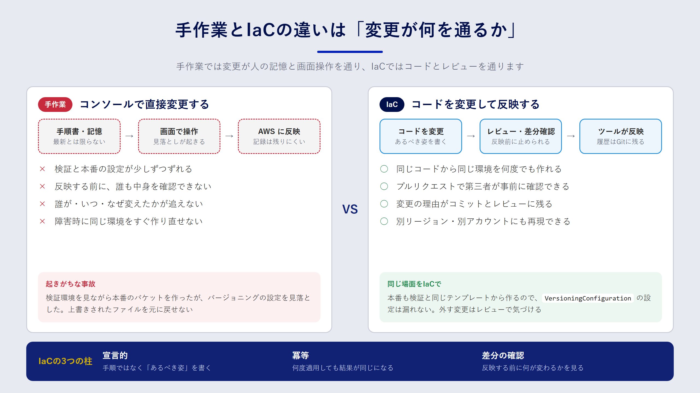

## この章で分かること

- コンソールでの手作業が、チームや環境が増えたときにどんな問題を起こすのか
- IaC の中心にある「宣言的」「冪等」「差分の確認」という考え方
- IaC で解決できることと、解決できないこと

## よくある事故から考える

あるチームで、Web アプリのファイル置き場として S3 バケットを使っていたとします。検証環境のバケットは、担当者がコンソールで丁寧に作りました。暗号化を有効にし、パブリックアクセスをブロックし、バージョニングもオンにしてあります。

半年後、本番環境を用意することになりました。前任者はすでに別のプロジェクトに移っています。後任者は検証環境の画面を見ながら同じ設定を再現しようとしましたが、バージョニングの設定を見落としました。本番稼働から数週間後、アプリの不具合でファイルが上書きされ、元に戻せないことが分かります。

この事故の原因は、担当者の不注意だけではありません。**「どんな設定であるべきか」がどこにも書かれていなかった** ことが本質的な問題です。コンソールの画面は「今どうなっているか」を示しますが、「なぜそうなっているか」「ほかの環境と同じか」は教えてくれません。

## 手作業の何が問題なのか

手作業でインフラを管理すると、次のような問題が起きやすくなります。

| 問題 | 具体的な症状 |
| --- | --- |
| 再現できない | 検証環境と本番環境の設定が少しずつずれていく |
| レビューできない | 変更の中身を事前に第三者が確認できない |
| 履歴が追えない | 誰が・いつ・なぜ変えたのかが分からない |
| 属人化する | 設定の意図を知っている人がいなくなると、触れなくなる |
| 復旧が遅い | 障害やリージョン移行のとき、同じ環境を素早く作り直せない |

どれも、チームが一人のうちは目立ちません。人数や環境の数が増えるほど、効いてきます。



## IaC とは何か

IaC は、インフラの構成をコードとして記述し、そのコードをもとにリソースを作成・変更・削除する方法です。先ほどの S3 バケットを CloudFormation で書くと、次のようになります。

```yaml:bucket.yaml
Resources:
  AppBucket:
    Type: AWS::S3::Bucket
    Properties:
      VersioningConfiguration:
        Status: Enabled
      PublicAccessBlockConfiguration:
        BlockPublicAcls: true
        BlockPublicPolicy: true
        IgnorePublicAcls: true
        RestrictPublicBuckets: true
```

このファイルが「あるべき設定」そのものになります。本番環境にも同じファイルを使えば、バージョニングを見落とすことはありません。設定を変えたいときはファイルを書き換え、プルリクエストでレビューしてから反映します。変更の理由はコミットメッセージに残ります。

### 三つの基本的な考え方

IaC を使いこなすうえで、押さえておきたい考え方が三つあります。

**1. 宣言的に書く**

「バケットを作る → バージョニングをオンにする」という **手順** ではなく、「バージョニングが有効なバケットがある」という **最終的な状態** を書きます。手順を考えるのはツールの仕事です。これを宣言的（declarative）な書き方と呼びます。

**2. 冪等である**

冪等（べきとう、idempotent）とは、同じ操作を何度実行しても結果が変わらない性質です。上のテンプレートを2回デプロイしても、バケットが2つできることはありません。2回目は「すでに望む状態なので何もしない」で終わります。この性質があるから、安心して何度でも適用できます。

**3. 適用前に差分を確認する**

コードを変えたら、実際に反映する前に「何が作られ、何が変わり、何が消えるのか」を確認します。CloudFormation では変更セット（change set）、CDK では `cdk diff` がこの役割を担います。特に、リソースが **作り直される（置き換え）** 変更は、データが消える原因になります。差分の確認は IaC でいちばん大事な習慣です。

:::message
「置き換え」は IaC 初心者がつまずきやすいポイントです。たとえば S3 のバケット名や DynamoDB テーブルのキー設定を変えると、既存のリソースは更新ではなく「新しく作って古いものを消す」扱いになります。4章で詳しく扱います。
:::

## IaC で解決できること

IaC を導入すると、先ほどの表の問題はそれぞれ次のように変わります。

- **再現できる**：同じコードから、検証環境と本番環境を同じ設定で作れます。環境ごとの違いは、パラメータとして明示的に書きます。
- **レビューできる**：インフラの変更がプルリクエストになり、アプリのコードと同じようにレビューできます。
- **履歴が追える**：Git の履歴を見れば、誰がいつ何を変えたかが分かります。
- **属人化しにくい**：設定の意図がコードとコメントに残ります。
- **作り直せる**：障害時やリージョン移行時も、コードを適用すれば同じ構成を再現できます。

さらに、コードになったことで **自動化** の道が開けます。テストを書く、静的チェックをかける、パイプラインで承認付きのデプロイを流す、といった仕組みです。9章では、これを Codeシリーズで実現します。

## IaC で解決できないこと

一方で、IaC は万能ではありません。導入前に、限界も知っておきましょう。

**データそのものは管理できない**

IaC が管理するのは、データベースやバケットという「入れ物」です。中に入っているデータは対象外です。データを守るには、バックアップや削除保護を別途設計する必要があります。10章で扱う `DeletionPolicy` や削除保護は、そのための仕組みです。

**悪い設計も正確に再現してしまう**

権限が広すぎる IAM ポリシーをコードにすると、その広すぎる権限が全環境に正確に広がります。IaC は品質を保証するものではなく、品質を「揃える」ものです。だからこそ、レビューや静的チェックと組み合わせる意味があります。

**手作業の変更を止められるわけではない**

IaC を導入しても、コンソールから設定を変えること自体はできてしまいます。コードと実際の状態がずれることを **ドリフト**（drift）と呼びます。ドリフトを防ぐには、「本番環境はコード経由でしか変えない」という運用ルールと、IAM による権限の制限を組み合わせます。

**シークレットをコードに書いてよいわけではない**

パスワードや API キーをテンプレートに直接書くと、Git の履歴に残ってしまいます。シークレットは AWS Secrets Manager などに保管し、コードからは参照だけするのが原則です。

:::message alert
一度でもパスワードをコミットしてしまったら、後のコミットで消しても履歴には残ります。公開リポジトリならすでに漏れたものとして扱い、パスワードそのものを変更してください。
:::

## まとめ

- 手作業の管理では、「あるべき設定」がどこにも書かれていないことが根本的な問題です。
- IaC は、宣言的に書く・冪等に適用する・適用前に差分を確認する、の三つを軸にします。
- IaC はデータの保護、設計の良し悪し、手作業による変更、シークレット管理までは解決しません。ほかの仕組みと組み合わせて使います。

## 確認問題

**問1.** 「冪等である」とはどういう性質ですか。IaC にとってなぜ重要なのかも説明してください。

:::details 解答例
同じ操作を何度実行しても結果が同じになる性質です。IaC のコードが冪等であれば、すでに望む状態になっている環境に何度適用しても余計な変更は起きません。そのため、「念のためもう一度適用する」「パイプラインで毎回適用する」といった運用を安心して行えます。
:::

**問2.** IaC を導入したのに、本番環境の設定がコードと食い違っていました。考えられる原因と対策を挙げてください。

:::details 解答例
コンソールや CLI から直接設定が変えられた（ドリフト）可能性があります。対策は、CloudFormation のドリフト検出で差分を見つけてコードに反映するか、コードの内容で上書きすることです。再発防止として、本番環境を変更できる IAM 権限をパイプラインのロールに限定し、人は原則として読み取り専用にします。
:::

**問3.** 「IaC を使えばセキュリティが高くなる」という意見に、補足を加えるとしたら何と言いますか。

:::details 解答例
IaC は設定を再現可能にしますが、設定の良し悪しは判断しません。広すぎる権限もそのまま全環境に広がります。セキュリティを高めるには、レビュー、cfn-lint などの静的チェック、CDK のテストなどと組み合わせて、危険な設定がマージされる前に止める仕組みが必要です。
:::
