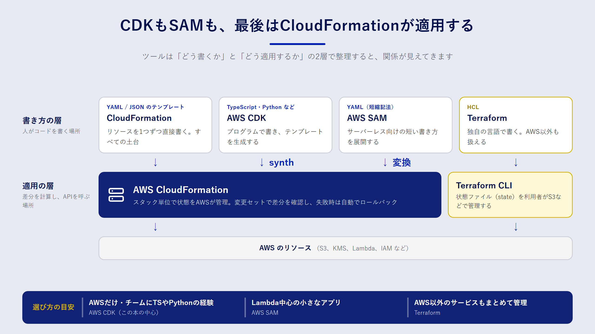

## この章で分かること

- AWS で使われる主な IaC ツール（CloudFormation、AWS CDK、AWS SAM、Terraform）の位置づけ
- ツールどうしの関係、特に「CDK は CloudFormation の上に乗っている」という構造
- チームでツールを選ぶときの判断軸

## ツールは「書き方」と「適用のしくみ」に分けて考える

IaC のツールはたくさんあり、最初はどれを選べばよいか迷います。整理のコツは、ツールを次の二つの層に分けて見ることです。

- **書き方の層**：インフラの定義を、どんな言語・形式で書くか（YAML、TypeScript、HCL など）
- **適用のしくみの層**：書いた定義を、誰がどうやって AWS に反映し、現在の状態をどこで覚えておくか

この二つの層で見ると、AWS 向けの主なツールは次のように並びます。

## AWS CloudFormation

CloudFormation は、AWS が提供する IaC のサービスです。YAML か JSON で **テンプレート** を書き、それを **スタック** という単位で AWS に適用します。

いちばんの特徴は、**適用のしくみが AWS のマネージドサービスとして動く** ことです。どのリソースを作ったか、今どんな状態かは CloudFormation が記録します。利用者が状態ファイルを保管する必要はありません。更新が途中で失敗すると、CloudFormation は変更前の状態へ自動で戻します（ロールバック）。

- 書き方：YAML / JSON
- 状態の管理：CloudFormation サービスが管理
- 向いている場面：AWS だけを対象にし、追加のツールを入れずに始めたいとき

## AWS CDK

AWS CDK（Cloud Development Kit）は、TypeScript・Python・Java・C#・Go などのプログラミング言語でインフラを定義するフレームワークです。

CDK で書いたコードは、`cdk synth` を実行すると **CloudFormation テンプレートに変換** されます。これを合成（synthesize）と呼びます。実際のデプロイは CloudFormation が行います。つまり CDK は「書き方の層」を置き換えるツールで、「適用のしくみの層」は CloudFormation をそのまま使っています。

プログラミング言語で書けると、次のような利点があります。

- ループや関数を使って、似た構成を繰り返し書かずに済む
- `bucket.grantRead(role)` のように、権限の設定を一行で書ける
- 型チェックやエディタの補完が効き、ユニットテストも書ける

一方で、抽象度が高いぶん「最終的にどんな CloudFormation テンプレートになるか」が見えにくくなります。CDK を使うときも、合成されたテンプレートを読める力は欠かせません。この本で CloudFormation を先に学ぶのはそのためです。

## AWS SAM

AWS SAM（Serverless Application Model）は、Lambda や API Gateway を中心としたサーバーレスアプリ向けの拡張です。テンプレートの先頭に `Transform: AWS::Serverless-2016-10-31` と書くと、`AWS::Serverless::Function` のような短い記法が使えます。これらはデプロイ時に通常の CloudFormation リソースに展開されます。

SAM CLI には、Lambda 関数をローカルで実行する機能もあります。サーバーレスアプリの開発では、CDK と並ぶ有力な選択肢です。

## Terraform

Terraform は HashiCorp 社が開発している IaC ツールです。HCL という独自の言語で書き、AWS 以外のクラウドや SaaS もまとめて管理できます。

CloudFormation との大きな違いは、**状態（state）を自分で管理する** 点です。Terraform は、作成したリソースの情報を状態ファイルに保存します。チームで使う場合は、この状態ファイルを S3 などの共有ストレージに置き、同時に更新されないようロックをかける必要があります。

:::message
Terraform は 2023年にライセンスを Business Source License（BSL）へ変更しました。これを受けて、オープンソースのまま開発を続けるフォークの OpenTofu が生まれています。社内で採用するときは、ライセンス条件も確認してください。
:::

## 比べてみる

四つのツールを並べると、次のようになります。

| 観点 | CloudFormation | AWS CDK | AWS SAM | Terraform |
| --- | --- | --- | --- | --- |
| 書き方 | YAML / JSON | TypeScript、Python など | YAML / JSON（短縮記法） | HCL |
| 適用のしくみ | CloudFormation | CloudFormation | CloudFormation | Terraform CLI |
| 状態の管理 | AWS が管理 | AWS が管理 | AWS が管理 | 利用者が管理（S3 など） |
| 対象 | AWS | AWS（中心） | AWS のサーバーレス | AWS を含む多数のサービス |
| 抽象化 | 低い（1リソース＝1定義） | 高い（まとめて定義できる） | 中程度 | 低〜中（モジュールで調整） |

## どれを選ぶか

ツール選びに唯一の正解はありません。次の問いに順番に答えていくと、候補が絞れます。

1. **管理対象は AWS だけか**。ほかのクラウドや SaaS も同じ仕組みで管理したいなら、Terraform（または OpenTofu）が有力です。
2. **チームにプログラミングの経験があるか**。アプリ開発者が中心なら CDK の利点を活かせます。インフラ担当者が中心で、コードの抽象化を避けたいなら CloudFormation のテンプレートを直接書くのも合理的です。
3. **サーバーレス中心か**。Lambda と API Gateway が主役で、ローカル実行もしたいなら SAM を検討します。
4. **既存の資産は何か**。すでに Terraform の資産や運用ノウハウがあるなら、無理に移行する必要はありません。

:::message
ツールを混在させると、同じリソースを二つのツールが管理してしまう事故が起きやすくなります。混在させる場合は、「ネットワークは Terraform、アプリは CDK」のように、担当範囲をはっきり分けてください。
:::

## この本での選択

この本では、CloudFormation と AWS CDK（TypeScript）を使います。理由は三つです。

- AWS だけを対象にするなら、状態の管理を AWS に任せられる CloudFormation 系が始めやすい
- CDK の土台は CloudFormation なので、両方を学ぶと知識がそのままつながる
- 9章で扱う CodePipeline には、CloudFormation の変更セットを作成・実行する機能が組み込まれている

4章で CloudFormation の基本を押さえ、5章で同じことを CDK で書き直す、という順番で進みます。

## まとめ

- IaC のツールは、「書き方の層」と「適用のしくみの層」に分けると整理できます。
- CDK と SAM は、どちらも最終的に CloudFormation テンプレートになり、CloudFormation がデプロイします。
- Terraform は独自の適用エンジンと状態ファイルを持ち、AWS 以外も管理できます。
- 選ぶときは、管理対象の範囲、チームのスキル、サーバーレスの比重、既存資産の四点で考えます。

## 確認問題

**問1.** 「CDK で書いたインフラは、CloudFormation を使わずにデプロイされる」は正しいですか。

:::details 解答
正しくありません。CDK のコードは `cdk synth` で CloudFormation テンプレートに変換され、デプロイは CloudFormation のスタックとして行われます。そのため、CDK で作ったリソースも CloudFormation のコンソールから確認できます。
:::

**問2.** Terraform を使うときに、CloudFormation では意識しなくてよかった作業は何ですか。

:::details 解答例
状態ファイルの管理です。Terraform は作成したリソースの情報を状態ファイルに保存するため、チームで使うなら S3 などの共有ストレージに置き、同時更新を防ぐロックも用意する必要があります。状態ファイルには機密情報が含まれることもあるので、暗号化とアクセス制御も欠かせません。CloudFormation では、状態の管理をサービス側が担います。
:::
