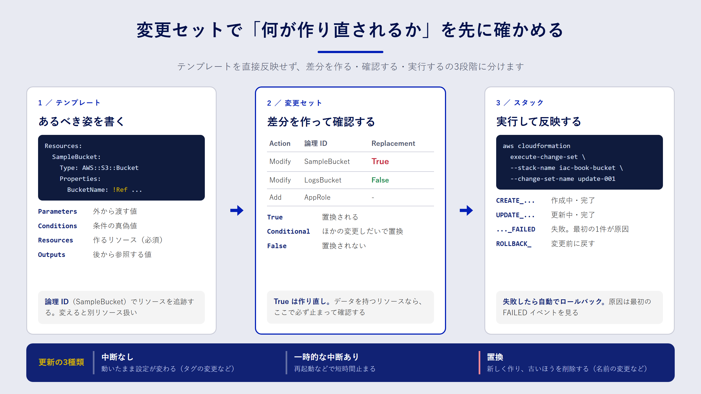

## この章で分かること

- CloudFormation の「テンプレート」「スタック」「変更セット」がそれぞれ何を指すのか
- テンプレートの主要なセクションと、よく使う組み込み関数
- 更新のときにリソースが「そのまま更新」されるのか「作り直し」になるのかを見分ける方法
- 変更セットを使って、本番に反映する前に差分を確かめる手順

## 3つの言葉を押さえる

CloudFormation を使い始めると、似た言葉がいくつも出てきます。最初に次の3つを区別しておくと、ドキュメントがぐっと読みやすくなります。

| 言葉 | 何を指すか | たとえるなら |
| --- | --- | --- |
| テンプレート（template） | 作りたいリソースを YAML か JSON で書いたファイル | 設計図 |
| スタック（stack） | テンプレートから作られた、リソースのまとまり | 設計図から建てた建物 |
| 変更セット（change set） | 今のスタックと新しいテンプレートの差分 | 改修工事の見積もり |

大事なのは、**CloudFormation が管理する単位はスタック**だという点です。同じテンプレートから、開発用と本番用の2つのスタックを作ることもできます。スタックを削除すると、そのスタックが作ったリソースも原則として削除されます。



## テンプレートを読んでみる

サンプルの `samples/cfn/s3-bucket.yaml` を見ていきましょう。非公開の S3 バケットを1つ作るテンプレートです。

```yaml:samples/cfn/s3-bucket.yaml
AWSTemplateFormatVersion: '2010-09-09'
Description: Sample private S3 bucket for Infrastructure as Code book
Parameters:
  BucketName:
    Type: String
    Default: iac-book-example-bucket
    Description: Globally unique bucket name
  EnableVersioning:
    Type: String
    Default: 'true'
    AllowedValues: ['true', 'false']
Conditions:
  VersioningEnabled: !Equals [!Ref EnableVersioning, 'true']
Resources:
  SampleBucket:
    Type: AWS::S3::Bucket
    DeletionPolicy: Retain
    UpdateReplacePolicy: Retain
    Properties:
      BucketName: !Ref BucketName
      PublicAccessBlockConfiguration:
        BlockPublicAcls: true
        BlockPublicPolicy: true
        IgnorePublicAcls: true
        RestrictPublicBuckets: true
      VersioningConfiguration: !If [VersioningEnabled, {Status: Enabled}, {Status: Suspended}]
      BucketEncryption:
        ServerSideEncryptionConfiguration:
          - ServerSideEncryptionByDefault:
              SSEAlgorithm: AES256
Outputs:
  BucketName:
    Description: Created bucket name
    Value: !Ref SampleBucket
  BucketArn:
    Description: Created bucket ARN
    Value: !GetAtt SampleBucket.Arn
```

上から順に、セクションの役割を見ます。

- **Parameters**：デプロイのときに外から渡す値です。環境ごとに変えたい値をここに出します。
- **Conditions**：パラメーターなどから真偽値を作ります。`VersioningEnabled` は「`EnableVersioning` が `'true'` かどうか」を表します。
- **Resources**：作るリソースの本体です。**このセクションだけは必須**で、ほかは省略できます。`SampleBucket` のような名前は「論理 ID」と呼ばれ、テンプレートの中でリソースを指す名前になります。
- **Outputs**：スタックを作ったあとに参照したい値を出力します。ほかのスタックや、人が確認するときに使います。

`DeletionPolicy: Retain` と `UpdateReplacePolicy: Retain` は、スタックの削除やリソースの作り直しが起きてもバケットを消さずに残す指定です。データを持つリソースには付けておくのが安全です。詳しくは10章で扱います。

:::message
論理 ID（`SampleBucket`）と物理 ID（実際のバケット名）は別物です。CloudFormation は論理 ID でリソースを追跡しているので、**論理 ID を変えると「別のリソース」と見なされ、作り直しになります**。リファクタリングで名前を変えるときは注意してください。
:::

## よく使う組み込み関数

テンプレートの中で値を組み立てるために、CloudFormation は「組み込み関数」を用意しています。YAML では `!` から始まる短縮形で書くのが一般的です。

| 関数 | 用途 | 例 |
| --- | --- | --- |
| `!Ref` | パラメーターの値、またはリソースの代表値（多くは名前や ID）を取る | `!Ref BucketName` |
| `!GetAtt` | リソースの属性を取る | `!GetAtt SampleBucket.Arn` |
| `!Sub` | 文字列に値を埋め込む | `!Sub 'arn:aws:s3:::${SampleBucket}/*'` |
| `!If` | 条件によって値を切り替える | `!If [VersioningEnabled, ..., ...]` |
| `!Equals` | 2つの値が等しいか判定する（Conditions で使う） | `!Equals [!Ref Env, prod]` |
| `!ImportValue` | 別スタックの Outputs（Export したもの）を読む | `!ImportValue SharedVpcId` |

`!Ref` で何が返るかはリソースの種類ごとに決まっています。S3 バケットならバケット名、IAM ロールならロール名です。ARN がほしいときは `!GetAtt` を使う、と覚えておくと迷いにくくなります。

`!Ref` や `!GetAtt` で別のリソースを参照すると、CloudFormation はその参照関係から**作成の順番を自動で決めます**。手順書で「先にこれを作って、次に……」と書いていた順序を、人が管理しなくてよくなります。

## スタックを更新するとき何が起きるか

IaC で一番気をつけたいのは、作るときより**変えるとき**です。CloudFormation はテンプレートの変更内容を見て、リソースごとに次の3通りのどれかで更新します。

| 更新の種類 | 何が起きるか | 例 |
| --- | --- | --- |
| 中断なし（No interruption） | 動いたまま設定が変わる | S3 バケットのタグを変える |
| 一時的な中断あり（Some interruptions） | 再起動などで短時間止まる | EC2 のインスタンスタイプを変える |
| 置換（Replacement） | 新しいリソースを作り、古いほうを削除する | S3 のバケット名を変える |

どのプロパティがどれに当たるかは、AWS ドキュメントのリソースリファレンスで各プロパティの「Update requires」欄に書かれています。**置換は、データを持つリソースでは事実上「データを捨てて作り直す」ことを意味します**。サンプルで `BucketName` を変更すると置換になりますが、`UpdateReplacePolicy: Retain` を付けているので、古いバケットは削除されずにスタックの管理から外れる形で残ります。

## 変更セットで差分を確かめる

「このテンプレートを反映すると何が起きるのか」を事前に確かめるのが変更セットです。いきなり更新するのではなく、次の3段階に分けます。

1. 変更セットを作る（この時点ではリソースは変わらない）
2. 変更セットの中身を確認する
3. 問題がなければ実行する（不要なら削除する）

AWS CLI では次のようになります。

```bash:変更セットを作って確認する
aws cloudformation create-change-set \
  --stack-name iac-book-bucket \
  --change-set-name update-001 \
  --template-body file://samples/cfn/s3-bucket.yaml \
  --parameters ParameterKey=BucketName,ParameterValue=iac-book-example-bucket

aws cloudformation wait change-set-create-complete \
  --stack-name iac-book-bucket --change-set-name update-001

aws cloudformation describe-change-set \
  --stack-name iac-book-bucket --change-set-name update-001 \
  --query 'Changes[].ResourceChange.[Action,LogicalResourceId,Replacement]' \
  --output table
```

スタックがまだない場合は、`create-change-set` に `--change-set-type CREATE` を付けます。

`describe-change-set` の結果で特に見るべきなのは `Replacement` の列です。`True` なら置換、`Conditional` なら「ほかの変更しだいで置換になりうる」という意味です。`True` が出たら、そのリソースが消えてよいものかどうかを必ず確認してください。

```bash:確認できたら実行する
aws cloudformation execute-change-set \
  --stack-name iac-book-bucket --change-set-name update-001
```

:::message alert
変更セットが示すのは、CloudFormation が把握している範囲の差分です。コンソールなどで手作業で変えた設定（ドリフト）は、変更セットには表れません。ドリフトの検出は10章で扱います。
:::

9章のパイプラインでは、この「作る → 確認する → 実行する」を CodePipeline の段階として組み込み、確認のところに人の承認を挟みます。

## 失敗したときはロールバックされる

スタックの作成や更新の途中でエラーが起きると、CloudFormation は既定では**変更前の状態に自動で戻します**（ロールバック）。途中まで作られたリソースが中途半端に残る事態を防ぐしくみです。

ロールバックの原因は、スタックのイベント履歴に記録されます。最初に `CREATE_FAILED` や `UPDATE_FAILED` になったイベントを探すと、原因にたどり着けます。後から出てくる失敗は、ロールバックに伴うものであることが多いからです。

```bash:最初に失敗したイベントを探す
aws cloudformation describe-stack-events --stack-name iac-book-bucket \
  --query "StackEvents[?contains(ResourceStatus, 'FAILED')].[Timestamp,LogicalResourceId,ResourceStatusReason]" \
  --output table
```

イベントは新しい順に並ぶので、表の一番下が最初の失敗です。

## デプロイ前にテンプレートを検査する

テンプレートの書き間違いは、デプロイしてから気づくと時間がかかります。手元で検査できる道具を使いましょう。

- **cfn-lint**：AWS が公開しているテンプレートの静的解析ツールです。プロパティ名の誤り、型の違い、リージョンで使えないリソースなどを指摘します。
- **`aws cloudformation validate-template`**：テンプレートの構文を AWS 側で確かめます。ただし、プロパティの中身までは詳しく検査しません。

```bash:cfn-lint でテンプレートを検査する
pip install cfn-lint
cfn-lint samples/cfn/*.yaml
```

この本のサンプルは、cfn-lint で警告が出ないことを確かめています。

## まとめ

- テンプレートは設計図、スタックはそこから作られたリソースのまとまり、変更セットは反映前の差分です。
- テンプレートで必須なのは Resources セクションだけです。論理 ID を変えると別リソース扱いになり、作り直しが起きます。
- 更新には「中断なし」「一時的な中断あり」「置換」の3種類があり、置換はデータを持つリソースにとって特に危険です。
- 変更セットで `Replacement` を確かめてから実行する流れを習慣にすると、更新の事故を大きく減らせます。

## 確認問題

**問1.** テンプレートの `SampleBucket` という論理 ID を `DataBucket` に変更して更新すると、何が起きますか。

:::details 解答
CloudFormation は `DataBucket` を新しいリソース、`SampleBucket` を削除されたリソースと見なします。そのため、新しいバケットの作成と、古いバケットの削除が計画されます（サンプルでは `DeletionPolicy: Retain` のため古いバケットは削除されず、スタックの管理外として残ります）。なお、`BucketName` を固定しているサンプルでは、同じ名前のバケットを新しく作ろうとして失敗します。
:::

**問2.** 変更セットの `Replacement` 列が `True` になっていたら、何を確認すべきですか。

:::details 解答例
そのリソースが作り直されても問題ないかを確認します。具体的には、データを持っていないか、ほかのシステムが名前や ARN を参照していないか、`DeletionPolicy` や `UpdateReplacePolicy` で保護されているか、を見ます。意図しない置換なら、テンプレートの変更内容を見直します。
:::

**問3.** スタックの更新が失敗してロールバックされました。原因を調べるには、イベント履歴のどこを見ればよいですか。

:::details 解答
時系列で**最初に** `CREATE_FAILED` または `UPDATE_FAILED` になったイベントの `ResourceStatusReason` を見ます。後に続く失敗は、ロールバックに伴って起きた二次的なものであることが多いためです。
:::
