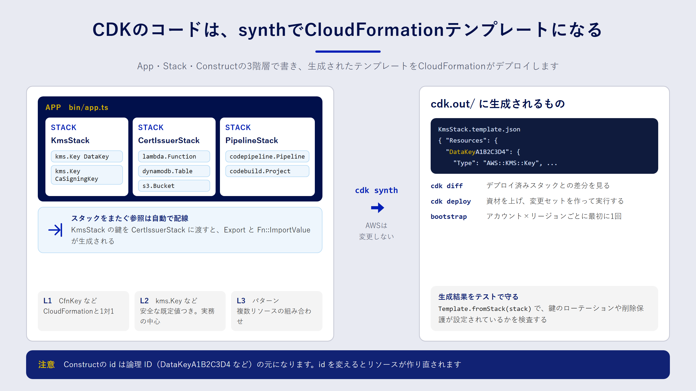

## この章で分かること

- CDK のアプリが App・Stack・Construct の3階層でできていること
- L1・L2・L3 という Construct の違いと、使い分けの目安
- `cdk synth` から `cdk deploy` までに、裏で何が起きているのか
- 初回に必要な「ブートストラップ」の意味
- CDK のコードをユニットテストで検査する方法

## CDK は CloudFormation を書くためのプログラム

AWS CDK（Cloud Development Kit）は、TypeScript や Python などのプログラミング言語でインフラを定義するためのフレームワークです。3章で見たとおり、CDK は最終的に CloudFormation のテンプレートを生成します。**実際にリソースを作るのは CloudFormation** で、CDK はその設計図を書くための道具です。

YAML を直接書く場合と比べて、CDK には次のような利点があります。

- 関数やクラスで共通部分をまとめられる。
- エディターの補完や型チェックが効き、書き間違いにすぐ気づける。
- `bucket.grantRead(role)` のように、意図を1行で表すと必要なポリシーが生成される。
- 普段のテストフレームワークで、インフラの定義をテストできる。

一方で、「生成されたテンプレートで何が作られるのか」を意識しないと、思わぬリソースが作られることもあります。この章では、CDK のコードと生成されるテンプレートを行き来しながら理解していきます。

## App・Stack・Construct の3階層

CDK のアプリは、次の3つの階層でできています。

| 階層 | 役割 | サンプルでの例 |
| --- | --- | --- |
| App | アプリ全体。1つ以上の Stack を持つ | `bin/app.ts` の `new cdk.App()` |
| Stack | CloudFormation のスタック1つに対応する単位 | `KmsStack`、`CertIssuerStack`、`PipelineStack` |
| Construct | リソース、またはリソースの組み合わせ | `new kms.Key(...)`、`new lambda.Function(...)` |



サンプルのエントリーポイントを見てみましょう。

```ts:samples/cdk/bin/app.ts
const app = new cdk.App();

// 環境は CLI の CDK_DEFAULT_ACCOUNT / CDK_DEFAULT_REGION から取る。
const env = {
  account: process.env.CDK_DEFAULT_ACCOUNT,
  region: process.env.CDK_DEFAULT_REGION,
};

const kms = new KmsStack(app, "KmsStack", { env });
const issuer = new CertIssuerStack(app, "CertIssuerStack", {
  env,
  caSigningKey: kms.caSigningKey,
  dataKey: kms.dataKey,
});
issuer.addDependency(kms);
new PipelineStack(app, "PipelineStack", { env });

app.synth();
```

`KmsStack` が作った鍵を、`CertIssuerStack` にプロパティとして渡しています。CDK はスタックをまたぐ参照を見つけると、CloudFormation の Export と `Fn::ImportValue` を自動で生成します。4章で見た `!ImportValue` を、手で書かなくてよいわけです。

どの Construct も、`new Xxx(scope, id, props)` という同じ形で作ります。`scope` は親（どこに置くか）、`id` は親の中での名前、`props` は設定です。この `id` は、生成されるテンプレートの論理 ID の元になります。4章で見たとおり**論理 ID が変わるとリソースは作り直しになる**ので、`id` は気軽に変えないようにしましょう。

## L1・L2・L3 の Construct

Construct には、抽象度の違う3つのレベルがあります。

| レベル | 特徴 | 例 |
| --- | --- | --- |
| L1 | CloudFormation のリソースと1対1。名前は `Cfn` で始まる | `kms.CfnKey` |
| L2 | 安全な既定値と便利なメソッドを備えた、よく使う形 | `kms.Key`、`s3.Bucket` |
| L3（パターン） | 複数のリソースを組み合わせた構成 | `ecs_patterns.ApplicationLoadBalancedFargateService` |

実務で中心になるのは L2 です。たとえば `s3.Bucket` は、何も指定しなくてもパブリックアクセスをブロックし、暗号化を有効にします。L2 がまだ対応していない新しいプロパティを使いたいときは、L1 を使うか、L2 から L1 を取り出して設定を上書きします。

```ts:L2 から L1 を取り出して上書きする例
const bucket = new s3.Bucket(this, 'LogsBucket');
const cfnBucket = bucket.node.defaultChild as s3.CfnBucket;
cfnBucket.addPropertyOverride('ObjectLockEnabled', true);
```

L3 は手早く構成を作れますが、中で何が作られるかが見えにくくなります。セキュリティ要件が厳しい場面では、L2 を組み合わせて自分で構成するほうが、レビューしやすくなります。

## synth と deploy で起きていること

CDK の中心になるコマンドは次の3つです。

| コマンド | 何をするか |
| --- | --- |
| `cdk synth` | コードを実行して CloudFormation テンプレートを `cdk.out/` に書き出す |
| `cdk diff` | 生成したテンプレートと、デプロイ済みのスタックの差分を表示する |
| `cdk deploy` | テンプレートと資材（Lambda のコードなど）をアップロードし、CloudFormation でデプロイする |

`cdk synth` は AWS に何も変更を加えません。手元でテンプレートを確認したいとき、テストの前に生成結果を見たいときに使います。この本のサンプルも、AWS アカウントなしで `synth` まで確かめられるようにしてあります。

```bash:AWS に接続せずにテンプレートを生成する
cd samples/cdk
npm ci
CDK_DEFAULT_ACCOUNT=111122223333 CDK_DEFAULT_REGION=ap-northeast-1 npx cdk synth KmsStack
```

`cdk deploy` は、既定では**変更セットを作ってから実行します**。つまり、4章の「作る → 確認する → 実行する」を自動でまとめて行っています。`--method=prepare-change-set` を付けると、変更セットを作ったところで止められます。9章のパイプラインでは、この「作る」と「実行する」を別の段階に分けます。

:::message
`cdk diff` は、デプロイ前に毎回確認する習慣をつけたいコマンドです。IAM ポリシーやセキュリティグループの変更は、表形式で強調して表示されます。
:::

## ブートストラップ：最初に1回だけ必要な準備

CDK でデプロイする前に、アカウントとリージョンの組ごとに1回、**ブートストラップ**が必要です。

```bash:ブートストラップ
npx cdk bootstrap aws://111122223333/ap-northeast-1
```

これを実行すると、`CDKToolkit` という名前のスタックが作られます。中身は、CDK がデプロイに使う作業場所と権限のセットです。

- **資材の置き場**：Lambda のコードやテンプレートを置く S3 バケットと、コンテナイメージを置く ECR リポジトリ
- **役割ごとの IAM ロール**：資材をアップロードするロール、デプロイを指示するロール、CloudFormation が実際にリソースを作るときに使うロールなど

最後の「CloudFormation が使うロール」には、既定では強い権限（`AdministratorAccess`）が付きます。本番のアカウントでは、`--cloudformation-execution-policies` で付けるポリシーを絞ることを検討してください。9章のパイプラインは、このブートストラップで作られたロールを引き受けてデプロイします。

## CDK のコードをテストする

CDK はプログラムなので、ユニットテストが書けます。`aws-cdk-lib/assertions` の `Template` を使うと、生成されるテンプレートの中身を検査できます。

```ts:KMS の鍵のテスト例
import { App } from 'aws-cdk-lib';
import { Template } from 'aws-cdk-lib/assertions';
import { KmsStack } from '../lib/kms-stack';

test('データ用の鍵はローテーションが有効', () => {
  const app = new App();
  const stack = new KmsStack(app, 'TestKmsStack');
  const template = Template.fromStack(stack);

  template.hasResourceProperties('AWS::KMS::Key', {
    EnableKeyRotation: true,
  });
});

test('鍵は削除されずに残る', () => {
  const app = new App();
  const template = Template.fromStack(new KmsStack(app, 'TestKmsStack'));

  template.allResources('AWS::KMS::Key', {
    DeletionPolicy: 'Retain',
    UpdateReplacePolicy: 'Retain',
  });
});
```

`hasResourceProperties` は「指定したプロパティを持つリソースが1つ以上あるか」、`allResources` は「その種類のリソースがすべて条件を満たすか」を検査します。ほかに、リソースの数を確かめる `resourceCountIs` もよく使います。

どんなテストを書くべきか迷ったら、**レビューで毎回確認していること**をテストにするのがおすすめです。「鍵が削除されない」「Lambda に `kms:*` が付いていない」「バケットが公開されていない」といった、壊れると困る性質をテストで守ります。

:::message alert
テンプレート全体を保存して比較する「スナップショットテスト」も書けます。ただし、CDK のバージョンを上げるだけで差分が出やすく、差分の意味を確認せずに更新してしまいがちです。まずは上のような、意図が読み取れるテストを優先しましょう。
:::

## まとめ

- CDK はプログラミング言語で CloudFormation テンプレートを生成する道具で、実際のデプロイは CloudFormation が行います。
- アプリは App・Stack・Construct の3階層です。Construct の `id` は論理 ID の元になるので、安易に変えないようにします。
- 実務の中心は L2 Construct です。足りないところは L1 やプロパティの上書きで補います。
- `cdk synth` は AWS を変更しません。`cdk deploy` は既定で変更セットを作ってから実行します。
- ブートストラップは、アカウントとリージョンの組ごとに1回必要です。
- レビューで確認している性質は、`Template` を使ったユニットテストで守れます。

## 確認問題

**問1.** `cdk synth` を実行すると、AWS アカウントには何が起きますか。

:::details 解答
何も起きません。`cdk synth` はコードを実行してテンプレートを `cdk.out/` に書き出すだけです。ただし、コードの中で VPC の検索などの「lookup」を使っている場合は、値を取得するために AWS の API を読み取りで呼び出すことがあります。
:::

**問2.** L2 Construct が対応していない CloudFormation のプロパティを設定したいとき、どうしますか。

:::details 解答例
L2 の `node.defaultChild` から L1（`Cfn` で始まるクラス）を取り出し、`addPropertyOverride` でプロパティを追加します。または、最初から L1 Construct を使って定義します。
:::

**問3.** ブートストラップで作られる `CDKToolkit` スタックには、主に何が含まれますか。

:::details 解答
デプロイの資材を置く S3 バケットと ECR リポジトリ、そして資材のアップロード、デプロイの指示、CloudFormation によるリソース作成などに使う IAM ロールです。
:::
