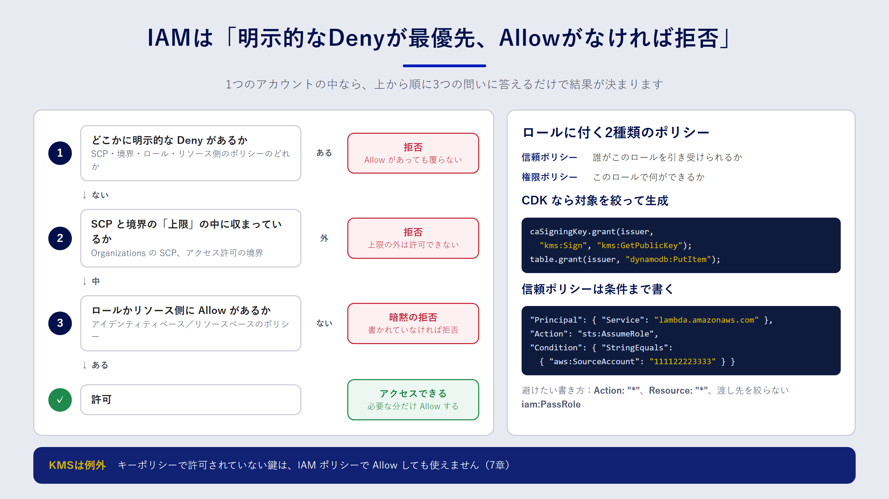

## この章で分かること

- IAM ポリシーがどう評価され、アクセスが許可・拒否されるのか
- 「信頼ポリシー」と「権限ポリシー」の違い
- CDK の `grant` メソッドを使って、最小権限をコードで表現する方法
- IaC で IAM を書くときに起きがちな失敗と、その防ぎ方

## なぜ IAM を IaC で管理するのか

IAM は AWS のあらゆる操作の入り口です。権限が広すぎれば事故や攻撃の被害が大きくなり、狭すぎればアプリが動きません。そして、権限の設定は後から見直しにくいものです。

コンソールで IAM を管理していると、「とりあえず動かすために付けた権限」が残り続けます。誰がなぜ付けたのか分からないので、外すのも怖くなります。IaC で管理すれば、権限の追加はプルリクエストになり、理由がレビューとコミットに残ります。さらに、ポリシーをテストで検査することもできます。

## ポリシー評価の基本

まず、AWS がアクセスを許可するか拒否するかをどう決めているのかを押さえましょう。細かい規則はたくさんありますが、一つのアカウントの中で考える限り、次の三つを覚えておけば大半の場面で判断できます。

1. **何も書かれていなければ拒否**（暗黙の拒否）。IAM は「許可したものだけ通す」仕組みです。
2. **どこかに `Allow` があれば許可の候補になる**。IAM ロールに付けたポリシー（アイデンティティベースのポリシー）か、S3 バケットポリシーのようなリソース側のポリシー（リソースベースのポリシー）のどちらかで許可されている必要があります。
3. **一つでも `Deny` があれば必ず拒否**（明示的な拒否）。どれだけ `Allow` があっても、`Deny` が優先します。



実際には、Organizations の SCP（サービスコントロールポリシー）やアクセス許可の境界（permissions boundary）も評価に加わります。これらは「上限」を決めるもので、ここで許可されていない操作は、ロールのポリシーで `Allow` しても実行できません。

:::message
KMS はこの規則の例外です。KMS の鍵は、**キーポリシーで許可されていない限り、IAM ポリシーだけでは使えません**。キーポリシーに「IAM ポリシーでの許可を有効にする」ステートメントがあって初めて、IAM ポリシーが効くようになります。7章で詳しく見ます。
:::

## 信頼ポリシーと権限ポリシー

IAM ロールには、性質の違う二種類のポリシーが付きます。混同しやすいので、ここで整理しておきます。

| 種類 | 答える問い | 例 |
| --- | --- | --- |
| 信頼ポリシー（trust policy） | **誰が** このロールを引き受けられるか | Lambda サービスがこのロールを使ってよい |
| 権限ポリシー（permissions policy） | このロールで **何が** できるか | 特定のバケットからオブジェクトを読める |

Lambda 関数用のロールなら、信頼ポリシーには「`lambda.amazonaws.com` が `sts:AssumeRole` できる」と書き、権限ポリシーには関数が必要とする操作だけを書きます。

```json:信頼ポリシーの例
{
  "Version": "2012-10-17",
  "Statement": [
    {
      "Effect": "Allow",
      "Principal": { "Service": "lambda.amazonaws.com" },
      "Action": "sts:AssumeRole"
    }
  ]
}
```

## CDK で最小権限を書く

CDK では、ポリシーの JSON を手で書く代わりに、リソースが持つ `grant` 系のメソッドを使うのが基本です。

```ts:grant の例
const role = new iam.Role(this, 'ReportReaderRole', {
  assumedBy: new iam.ServicePrincipal('lambda.amazonaws.com'),
});

// バケットの読み取り権限だけを付ける
reportBucket.grantRead(role);
```

`grantRead` は、`s3:GetObject*`・`s3:GetBucket*`・`s3:List*` を、そのバケットとその中のオブジェクトだけに限定して許可するポリシーを生成します。バケットが KMS の鍵で暗号化されていれば、復号に必要な `kms:Decrypt` も自動で追加されます。ARN を手で組み立てる必要がないので、書き間違いも防げます。

`grant` で表せない権限は、`addToPolicy` や `addToRolePolicy` で明示的に書きます。このときも、`actions` と `resources` はできるだけ絞ります。

```ts:明示的に書く例
issuerFunction.addToRolePolicy(new iam.PolicyStatement({
  actions: ['kms:Sign', 'kms:GetPublicKey'],
  resources: [caSigningKey.keyArn],
}));
```

これは8章で使う証明書発行 Lambda の権限です。署名に使う鍵一つに対して、署名と公開鍵の取得だけを許可しています。鍵の削除やポリシーの変更はできません。

## よくある失敗と防ぎ方

### `Resource: "*"` と `Action: "*"`

動かないときに「とりあえず全部許可」とすると、そのまま本番環境まで届いてしまいます。IaC では、これが全環境に正確にコピーされる点が怖いところです。ワイルドカードを使うのは、`sts:GetCallerIdentity` のようにリソースを指定できない操作に限りましょう。

### 広すぎる `iam:PassRole`

`iam:PassRole` は、「自分が持っているロールを、Lambda や EC2 などのサービスに渡す」権限です。これを `Resource: "*"` で許可すると、管理者権限を持つロールを Lambda に渡して、間接的に何でもできてしまいます。渡してよいロールの ARN を明示し、可能なら `iam:PassedToService` 条件で渡し先のサービスも絞ります。

### 信頼ポリシーの条件漏れ

サービスがロールを引き受ける場合でも、「どのリソースから引き受けたか」を条件で絞れることがあります。たとえば、別のアカウントのリソースに自分のロールを悪用される「混乱した代理（confused deputy）」問題を防ぐために、`aws:SourceArn` や `aws:SourceAccount` を条件に入れます。

```json:信頼ポリシーに条件を付ける例
{
  "Effect": "Allow",
  "Principal": { "Service": "codepipeline.amazonaws.com" },
  "Action": "sts:AssumeRole",
  "Condition": {
    "StringEquals": { "aws:SourceAccount": "111122223333" }
  }
}
```

## コードで権限を検査する

IaC にしたからこそできることの一つが、権限の自動検査です。代表的な方法を三つ紹介します。

**CDK のユニットテスト**

`aws-cdk-lib/assertions` を使うと、合成されたテンプレートに特定のポリシーが含まれているか、含まれていないかをテストできます。

```ts:権限をテストする例
test('発行用 Lambda は kms:* を持たない', () => {
  const template = Template.fromStack(stack);
  const policies = template.findResources('AWS::IAM::Policy');
  const json = JSON.stringify(policies);
  expect(json).not.toContain('"kms:*"');
});
```

**cfn-lint**

CloudFormation テンプレートの静的チェックツールです。文法の誤りや、存在しないプロパティ、よくある設定ミスを検出します。

**IAM Access Analyzer のポリシー検証**

IAM Access Analyzer には、ポリシーの文法チェックや、セキュリティ上の警告（たとえば `iam:PassRole` とワイルドカードの組み合わせ）を出す機能があります。パイプラインに組み込むと、危険な権限がマージされる前に気づけます。

:::message
テストで「持っていてほしくない権限」を明文化しておくと、将来だれかが権限を広げたときにテストが失敗して気づけます。8章のサンプルでは、証明書発行 Lambda が `kms:*` を持たないことをテストで確認しています。
:::

## まとめ

- アクセスは「暗黙の拒否 → Allow で許可候補 → 明示的な Deny で必ず拒否」の順で考えると判断しやすくなります。
- IAM ロールには、「誰が引き受けられるか」を決める信頼ポリシーと、「何ができるか」を決める権限ポリシーがあります。
- CDK では `grant` 系のメソッドを使うと、対象を絞ったポリシーを安全に生成できます。
- ワイルドカード、広すぎる `iam:PassRole`、信頼ポリシーの条件漏れは、テストや静的チェックで防ぎます。

## 確認問題

**問1.** ロールの権限ポリシーで `s3:GetObject` を `Allow` しているのに、アクセスが拒否されました。考えられる原因を二つ挙げてください。

:::details 解答例
- バケットポリシーや SCP など、どこかに明示的な `Deny` がある（`Deny` は常に優先されます）。
- SCP やアクセス許可の境界が上限を決めていて、その範囲に `s3:GetObject` が含まれていない。

ほかに、オブジェクトが KMS の鍵で暗号化されていて、`kms:Decrypt` の権限がない、というケースもよくあります。
:::

**問2.** 信頼ポリシーと権限ポリシーは、それぞれ何を決めるものですか。

:::details 解答
信頼ポリシーは「誰がそのロールを引き受けられるか」を、権限ポリシーは「そのロールで何ができるか」を決めます。Lambda 用のロールであれば、信頼ポリシーで `lambda.amazonaws.com` を許可し、権限ポリシーで関数が必要とする操作だけを許可します。
:::

**問3.** `iam:PassRole` を `Resource: "*"` で許可すると、なぜ危険なのですか。

:::details 解答例
自分が持っていない強い権限を持つロールでも、Lambda や EC2 などに渡せてしまうからです。たとえば管理者権限のロールを付けた Lambda 関数を作れば、その関数を通じて間接的に管理者の操作ができます。渡してよいロールの ARN を明示し、渡し先のサービスも条件で絞るのが原則です。
:::
