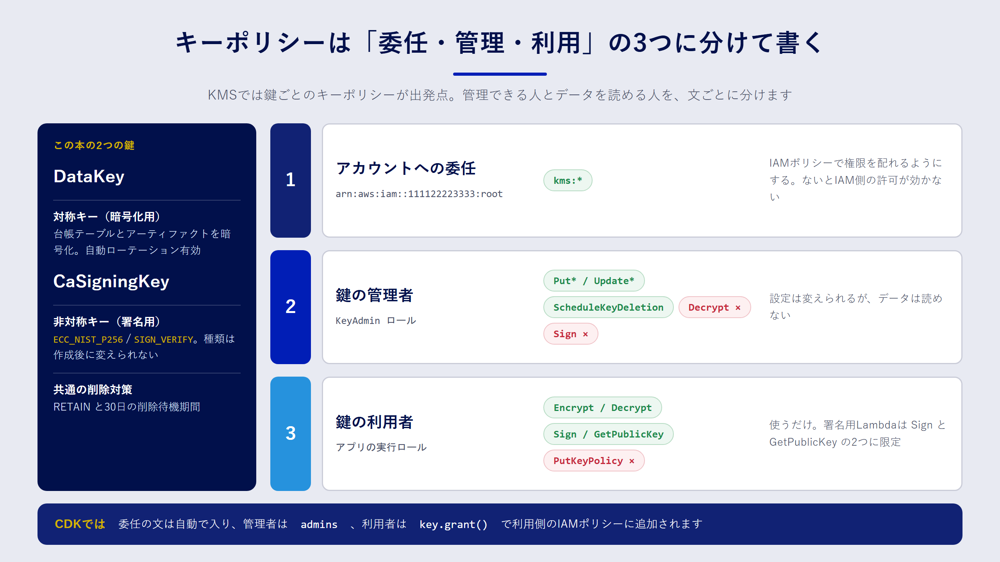

## この章で分かること

- KMS の鍵を IaC で管理すると、何がうれしいのか
- キーポリシーで「鍵を管理する人」と「鍵を使う人」を分ける方法
- 鍵を誤って削除しないための設定と、ローテーションの考え方

## 鍵こそコードで管理したい

AWS Key Management Service（KMS）は、暗号化や署名に使う鍵を作って保管するサービスです。鍵の本体は KMS の外に出ることがなく、利用者は「この鍵で暗号化して」「この鍵で署名して」と API で依頼するだけです。

鍵は、ほかのリソースと比べて失敗したときの影響が大きいリソースです。

- 鍵を削除すると、その鍵で暗号化したデータは二度と復号できません。
- キーポリシー（鍵に付けるアクセス制御）を誤ると、誰も鍵を使えなくなったり、逆に使わせたくない人まで使えたりします。
- 非対称キーの種類（鍵の長さやアルゴリズム）は、作ったあとで変えられません。

だからこそ、コンソールで作るのではなく、IaC で「どんな設定で、誰に何を許すのか」をレビューしてから作るのが向いています。この章では、8章の証明書発行 Lambda で使う二つの鍵を題材にします。

## 対称キーと非対称キー

KMS の鍵には、大きく分けて2種類あります。

| 種類 | 仕組み | 主な用途 | この本での使い方 |
| --- | --- | --- | --- |
| 対称キー | 暗号化と復号に同じ鍵を使う | S3・DynamoDB などのデータ暗号化 | `DataKey`：証明書台帳やアーティファクトの暗号化 |
| 非対称キー | 秘密鍵と公開鍵のペア | デジタル署名、公開鍵暗号 | `CaSigningKey`：クライアント証明書への署名 |

対称キーは、AWS のサービスと組み合わせて「保存データの暗号化」に使うのが一般的です。S3 バケットや DynamoDB テーブルに鍵を指定すると、読み書きのたびにサービスが裏で KMS を呼び出します。

非対称キーは、秘密鍵を KMS の中に閉じ込めたまま署名できる点が特長です。8章では、この性質を使って「秘密鍵をどこにも保存しない認証局（CA）」を作ります。非対称キーの **キー仕様**（`ECC_NIST_P256` など）と **キーの用途**（署名用の `SIGN_VERIFY` か、暗号化用の `ENCRYPT_DECRYPT` か）は作成後に変更できないので、最初に正しく決めておく必要があります。

## キーポリシーを理解する

KMS の権限は、IAM とは少し考え方が違います。ほかのサービスでは IAM ポリシーだけで権限が決まることが多いのに対して、KMS では **鍵ごとのキーポリシーが出発点** になります。キーポリシーで許可されていない限り、IAM ポリシーで `Allow` しても鍵は使えません。



実務でよく使うのは、次の三つの文（Statement）の組み合わせです。

1. **アカウントへの委任**：アカウントのルート（`arn:aws:iam::111122223333:root`）に `kms:*` を許可する文です。AWS が作るデフォルトのキーポリシーにも含まれています。「ルートユーザーに全権を渡す」という意味ではなく、「このアカウントの IAM ポリシーで、鍵の権限を配ってよい」という委任の意味を持ちます。これがないと、IAM 側でどれだけ許可しても鍵を使えません。
2. **鍵の管理者**：鍵の設定変更、エイリアスの管理、削除の予約などを許可します。暗号化・復号・署名は含めません。
3. **鍵の利用者**：暗号化・復号、あるいは署名など、実際に鍵を使う操作だけを許可します。設定の変更はできません。

:::message
管理者と利用者を分けておくと、「鍵の設定を変えられる人」と「データを読める人」が別になります。鍵の管理者であっても、利用者として許可されていなければデータを復号できません。職務の分離（Separation of Duties）を、鍵の単位で実現できるわけです。
:::

### CloudFormation で書く

`samples/cfn/kms-key.yaml` は、三つの文をそのまま書いた例です。管理者と利用者のロールは、パラメータで受け取ります。

```yaml:samples/cfn/kms-key.yaml（抜粋）
Resources:
  DataKey:
    Type: AWS::KMS::Key
    DeletionPolicy: Retain
    UpdateReplacePolicy: Retain
    Properties:
      Description: Data encryption key for the IaC book sample
      EnableKeyRotation: true
      PendingWindowInDays: 30
      KeyPolicy:
        Version: '2012-10-17'
        Statement:
          - Sid: EnableAccountDelegation
            Effect: Allow
            Principal:
              AWS: !Sub 'arn:${AWS::Partition}:iam::${AWS::AccountId}:root'
            Action: kms:*
            Resource: '*'
          - Sid: KeyAdministration
            Effect: Allow
            Principal:
              AWS: !Ref KeyAdminRoleArn
            Action:
              - kms:Describe*
              - kms:Put*
              - kms:Update*
              - kms:ScheduleKeyDeletion
              - kms:CancelKeyDeletion
              # ほかの管理系アクションは省略
            Resource: '*'
          - Sid: KeyUsage
            Effect: Allow
            Principal:
              AWS: !Ref KeyUserRoleArn
            Action:
              - kms:Encrypt
              - kms:Decrypt
              - kms:ReEncrypt*
              - kms:GenerateDataKey*
              - kms:DescribeKey
            Resource: '*'
```

キーポリシーの中の `Resource: '*'` は、「この鍵自身」を指します。キーポリシーは鍵に直接付くので、ほかの鍵を指すことはありません。IAM ポリシーの `Resource: "*"` とは意味が違うので、ここは安心して書いて大丈夫です。

### CDK で書く

CDK の `kms.Key` を使うと、委任の文は自動でキーポリシーに入ります。管理者は `admins` で指定し、利用者は鍵を使う側で `grant` 系のメソッドを呼んで許可します。サンプルの `KmsStack` は次のとおりです。

```ts:samples/cdk/lib/kms-stack.ts（抜粋）
const adminRoleArn = this.node.tryGetContext("keyAdminRoleArn") as string | undefined;
const admins = adminRoleArn
  ? [iam.Role.fromRoleArn(this, "KeyAdminRole", adminRoleArn, { mutable: false })]
  : undefined;

// データ暗号化用の対称キー
this.dataKey = new kms.Key(this, "DataKey", {
  description: "IaC book sample: data encryption key",
  enableKeyRotation: true,
  pendingWindow: cdk.Duration.days(30),
  removalPolicy: cdk.RemovalPolicy.RETAIN,
  alias: "iac-book/data",
  admins,
});

// クライアント証明書に署名するための非対称キー
this.caSigningKey = new kms.Key(this, "CaSigningKey", {
  keySpec: kms.KeySpec.ECC_NIST_P256,
  keyUsage: kms.KeyUsage.SIGN_VERIFY,
  pendingWindow: cdk.Duration.days(30),
  removalPolicy: cdk.RemovalPolicy.RETAIN,
  alias: "iac-book/client-ca",
  admins,
});
```

管理者のロールは、`cdk deploy -c keyAdminRoleArn=arn:aws:iam::111122223333:role/KeyAdmin` のようにコンテキストで渡します。指定しなければ委任の文だけになり、IAM ポリシー側で管理者を決める運用になります。

利用者の権限は、8章の `CertIssuerStack` で次のように付けています。

```ts:samples/cdk/lib/cert-issuer-stack.ts（抜粋）
// 署名用の鍵は、署名と公開鍵の取得だけ
caSigningKey.grant(issuer, "kms:Sign", "kms:GetPublicKey");
// 台帳テーブルの暗号化に使う鍵は、暗号化と復号
dataKey.grantEncryptDecrypt(issuer);
```

`grant` は、指定した操作だけを、その鍵だけに限定して許可する IAM ポリシーを生成します。`kms:*` のような広い許可を書かずに済むのが利点です。

:::message
DynamoDB テーブルや S3 バケットをカスタマーマネージドキーで暗号化すると、テーブルを読み書きする側にも KMS の権限が必要になります。サービスが呼び出し元に代わって KMS を呼ぶためです。「DynamoDB の権限は付けたのに AccessDenied になる」ときは、まず鍵の権限を疑いましょう。
:::

## 鍵を削除から守る

鍵の削除は、IaC の操作ミスで起こり得る事故の中でも特に影響が大きいものです。サンプルでは、三重の備えをしています。

| 設定 | 効果 |
| --- | --- |
| `removalPolicy: RETAIN` | スタックを削除しても、鍵は削除せずに残す |
| `pendingWindow: 30日` | 削除を予約してから実際に消えるまでの待機期間。7〜30日で指定し、その間は取り消せる |
| `alias` | 鍵 ID ではなく別名（`alias/iac-book/data`）で参照できるようにする |

KMS の鍵は、`ScheduleKeyDeletion` で削除を予約しても、待機期間が過ぎるまでは `CancelKeyDeletion` で取り消せます。待機期間を最大の30日にしておけば、誤って予約しても気づく時間を確保できます。待機期間中の鍵は使えなくなるので、利用しているサービスでエラーが出はじめたら、それが気づくきっかけになります。

## ローテーションの考え方

**自動ローテーション** は、対称キーで使える機能です。有効にすると、KMS が定期的に新しい鍵の素材（キーマテリアル）を作ります。既定では1年ごとで、間隔は変更できます。古い素材も KMS の中に残るので、過去に暗号化したデータもそのまま復号できます。鍵 ID や ARN は変わらないので、アプリケーション側の変更は不要です。

一方、非対称キーは自動ローテーションに対応していません。署名用の鍵を入れ替えたいときは、新しい鍵を作り、エイリアスの向き先を切り替えます。8章の CA 用の鍵で考えると、次の手順になります。

1. 新しい非対称キーを作り、新しい CA 証明書を発行する
2. mTLS のトラストストアに、新旧両方の CA 証明書を入れる
3. 発行 Lambda を新しい鍵に切り替える
4. 古い CA で発行した証明書がすべて期限切れになってから、古い CA をトラストストアから外す

鍵の種類を変えられないことも含めて、非対称キーは「作り直す前提」で運用を設計しておくと安心です。

## テストで設定を守る

鍵の設定は、あとから誰かがうっかり変えてしまうと危険です。CDK のユニットテストで、守りたい設定を明文化しておきます。

```ts:samples/cdk/test/stacks.test.ts（抜粋）
test("DataKey はローテーション有効・CaSigningKey は署名専用の非対称キー", () => {
  const t = Template.fromStack(kmsStack());
  t.hasResourceProperties("AWS::KMS::Key", { EnableKeyRotation: true });
  t.hasResourceProperties("AWS::KMS::Key", {
    KeySpec: "ECC_NIST_P256",
    KeyUsage: "SIGN_VERIFY",
  });
});
```

`removalPolicy: RETAIN` は、テンプレート上では `DeletionPolicy: Retain` になります。これもテストで確認しておくと、削除ポリシーを外す変更がレビューをすり抜けにくくなります。

## コストの目安

カスタマーマネージドキーは、1個あたり月額の料金がかかります。加えて、暗号化・復号・署名などの API 呼び出しにもリクエスト単位の料金がかかります。自動ローテーションで増えた古いキーマテリアルにも料金がかかる場合があります。料金は変わることがあるので、使う前に AWS KMS の料金ページで確認してください（本書の記述は2026年9月時点の情報をもとにしています）。

## まとめ

- KMS の鍵は、削除やポリシーの誤りの影響が大きいので、IaC でレビューしてから作ります。
- キーポリシーは「アカウントへの委任」「鍵の管理者」「鍵の利用者」の三つの文に分けると、職務を分離できます。
- CDK では、管理者を `admins`、利用者を `grant` で指定します。利用者の権限は必要な操作だけに絞ります。
- `RETAIN`、30日の削除待機期間、エイリアスで、鍵を誤削除から守ります。
- 対称キーは自動ローテーションを有効にし、非対称キーは新しい鍵への切り替え手順を用意しておきます。

## 確認問題

**問1.** IAM ポリシーで `kms:Decrypt` を許可したのに、復号が拒否されました。キーポリシー側で確認すべき点は何ですか。

:::details 解答例
キーポリシーに、アカウントへの委任の文（ルートへの `kms:*` の許可）があるかを確認します。この文がないと、IAM ポリシーでの許可は鍵に対して効きません。委任の文を置かない設計なら、キーポリシー自体にそのロールへの `kms:Decrypt` の許可が必要です。
:::

**問2.** 鍵の管理者に `kms:Decrypt` を含めないのは、なぜですか。

:::details 解答例
鍵の設定を変更できる人と、データを読める人を分けるためです。管理者が復号もできると、一人でデータを読み出せてしまいます。役割を分けておけば、どちらか一方の権限が漏れても被害を限定できます。
:::

**問3.** 8章の CA 署名用の非対称キーを、別のキー仕様に変更したくなりました。どう対応すればよいですか。

:::details 解答例
キー仕様は作成後に変更できないので、新しい非対称キーを作ります。新しい鍵で CA 証明書を作り、トラストストアに新旧両方の CA 証明書を入れたうえで、発行 Lambda を新しい鍵に切り替えます。古い CA の証明書がすべて期限切れになってから、古い CA をトラストストアから外します。
:::
