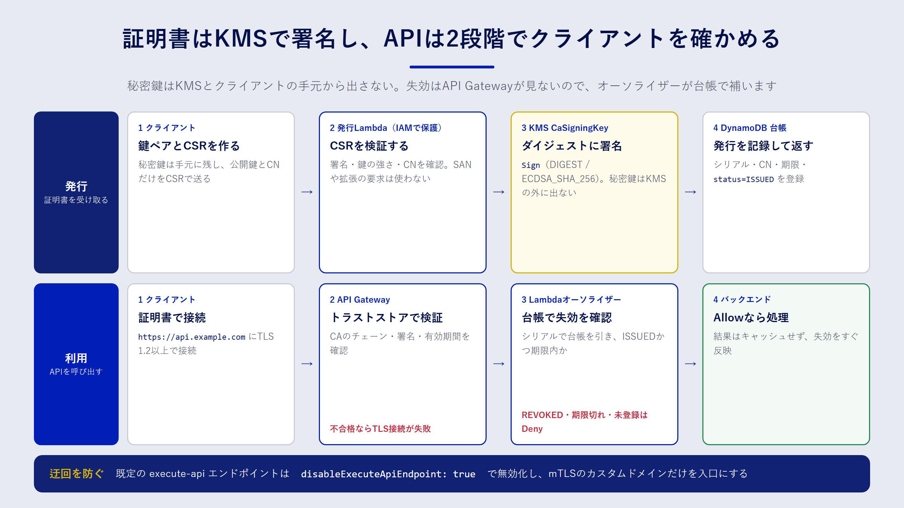

## この章で分かること

- mTLS（相互 TLS）とクライアント証明書の仕組み
- KMS の非対称キーを CA の鍵にして、証明書を発行する Lambda の作り方
- API Gateway で mTLS を有効にするときの設定と、失効確認を補う方法

## mTLS とは

ふだんの HTTPS（TLS）では、クライアントがサーバーの証明書を確かめます。「接続先が本物の `api.example.com` か」を確認する一方向の認証です。

**mTLS**（mutual TLS、相互 TLS）では、これに加えてサーバーもクライアントの証明書を確かめます。クライアントは、サーバーが信頼する認証局（CA）から発行された **クライアント証明書** と、その秘密鍵を持っていないと接続できません。

mTLS は、次のような場面でよく使われます。

- 取引先のシステムどうしを API でつなぐ（B2B 連携）
- 工場の機器や IoT デバイスから、クラウドへデータを送る
- 社内システムの間で、パスワードや API キーの代わりに証明書で認証する

API キーは文字列なので、漏れればそのまま使われてしまいます。クライアント証明書を使う方式なら、秘密鍵はクライアントの手元から出ません。通信路でやり取りされるのは公開鍵を含む証明書と署名だけなので、盗み見られても認証を突破されにくくなります。

## この章で作るもの

この章のサンプルは、次の三つの部品でできています。



1. **CA**：7章の非対称キー `CaSigningKey` を CA の鍵として使います。秘密鍵は KMS の外に出ません。
2. **証明書発行 Lambda**：クライアントから受け取った CSR（証明書署名要求）を検証し、KMS で署名してクライアント証明書を返します。発行した証明書は DynamoDB の台帳に記録します。
3. **mTLS 対応 API**：API Gateway のカスタムドメイン名で mTLS を有効にします。証明書の失効は API Gateway が確認しないので、Lambda オーソライザーで台帳を照合して補います。

### 証明書を発行するまでの流れ

1. 管理者が最初に一度だけ、`init-ca` コマンドで CA 証明書を作り、S3 に置きます。
2. クライアントは手元で鍵ペアを作り、公開鍵を含む CSR を作ります。秘密鍵は手元に残します。
3. 発行 Lambda を呼び出して CSR を渡します。Lambda は IAM で保護し、許可されたロールだけが呼び出せます。
4. Lambda は CSR を検証し、証明書の中身を組み立てて、KMS の `Sign` API で署名します。
5. 証明書のシリアル番号と有効期限を台帳に記録し、証明書をクライアントに返します。

### API を呼び出すときの流れ

1. クライアントは、証明書と秘密鍵を使って `https://api.example.com` に接続します。
2. API Gateway は、証明書がトラストストアの CA から発行されたものか、有効期間内かを確かめます。ここで不合格なら、TLS の接続自体が失敗します。
3. 合格すると、Lambda オーソライザーが呼ばれます。オーソライザーは証明書のシリアル番号で台帳を引き、失効していないかを確かめます。
4. 台帳で `ISSUED`（発行済み）かつ期限内なら `Allow`、それ以外は `Deny` を返します。

:::message
CA を作る方法としては、マネージドサービスの AWS Private CA もあります。証明書の失効リスト（CRL）や OCSP にも対応していて、本番で多数の証明書を扱うなら第一候補です。一方で、CA ごとに月額の料金がかかります。この本では、KMS と Lambda の組み合わせで仕組みを理解することを優先して、自前の小さな CA を作ります。料金は変わることがあるので、採用を検討するときは公式の料金ページで確認してください（2026年9月時点）。
:::

## KMS の鍵で証明書に署名する

Go の標準ライブラリで証明書を作るには、`x509.CreateCertificate` を使います。この関数は、秘密鍵そのものではなく `crypto.Signer` というインターフェースを受け取ります。

```go:crypto.Signer インターフェース（Go 標準ライブラリ）
type Signer interface {
    Public() crypto.PublicKey
    Sign(rand io.Reader, digest []byte, opts crypto.SignerOpts) ([]byte, error)
}
```

つまり、「公開鍵を返す」「ダイジェストに署名する」の二つを KMS の API で実装すれば、秘密鍵を持たずに証明書を作れます。サンプルの `kmssigner` パッケージがこの実装です。

```go:samples/lambda/internal/kmssigner/kmssigner.go（抜粋）
// New は keyID の公開鍵を KMS から取得して Signer を作る。
func New(ctx context.Context, client API, keyID string) (*Signer, error) {
	out, err := client.GetPublicKey(ctx, &kms.GetPublicKeyInput{KeyId: aws.String(keyID)})
	if err != nil {
		return nil, fmt.Errorf("GetPublicKey: %w", err)
	}
	pub, err := x509.ParsePKIXPublicKey(out.PublicKey)
	if err != nil {
		return nil, fmt.Errorf("ParsePKIXPublicKey: %w", err)
	}
	return &Signer{client: client, keyID: keyID, public: pub}, nil
}

// Sign は digest に KMS で ECDSA_SHA_256 署名する。返り値は DER 形式。
func (s *Signer) Sign(rand io.Reader, digest []byte, opts crypto.SignerOpts) ([]byte, error) {
	if opts.HashFunc() != crypto.SHA256 {
		return nil, fmt.Errorf("unsupported hash: %v", opts.HashFunc())
	}
	out, err := s.client.Sign(context.Background(), &kms.SignInput{
		KeyId:            aws.String(s.keyID),
		Message:          digest,
		MessageType:      types.MessageTypeDigest,
		SigningAlgorithm: types.SigningAlgorithmSpecEcdsaSha256,
	})
	if err != nil {
		return nil, fmt.Errorf("kms.Sign: %w", err)
	}
	return out.Signature, nil
}
```

ポイントは三つあります。

- **公開鍵の形式**：`GetPublicKey` は公開鍵を DER 形式（SubjectPublicKeyInfo）で返します。`x509.ParsePKIXPublicKey` でそのまま Go の公開鍵に変換できます。
- **ダイジェストを送る**：KMS の `Sign` に渡せるメッセージは 4096 バイトまでです。証明書の本体はこれを超えることがあるので、ハッシュ値（ダイジェスト）を送り、`MessageType` に `DIGEST` を指定します。`x509.CreateCertificate` は、もともとダイジェストを渡してくれます。
- **署名の形式**：KMS の ECDSA 署名は DER 形式で返ります。Go の `crypto/ecdsa` が期待する形式と同じなので、変換は要りません。

`ECC_NIST_P256` の鍵に対して SHA-256 以外のハッシュが来た場合は、エラーにして拒否します。想定外の組み合わせを黙って通さないためです。

## CSR を検証して証明書を組み立てる

発行 Lambda は、受け取った CSR をそのまま信用してはいけません。CSR はクライアントが自由に作れるので、「CA として使える証明書がほしい」「別のドメイン名も入れてほしい」といった要求を紛れ込ませることができます。サンプルでは、次の方針で検証します。

| 確認すること | 方針 |
| --- | --- |
| CSR の署名 | `CheckSignature` で、CSR が公開鍵に対応する秘密鍵で署名されているかを確かめる |
| 鍵の種類と長さ | ECDSA の P-256・P-384、または RSA 2048 ビット以上だけを受け付ける |
| CN（共通名） | `^[a-z0-9][a-z0-9-]{2,62}$` に合う名前だけを受け付ける |
| SAN や拡張の要求 | CSR に書かれていても使わない。証明書の中身は発行側のテンプレートで決める |

証明書の中身（テンプレート）は、発行側で決めた値だけで組み立てます。

```go:samples/lambda/internal/certissue/certissue.go（抜粋）
return &x509.Certificate{
	SerialNumber:          serial, // 正の128ビット乱数
	Subject:               pkix.Name{CommonName: csr.Subject.CommonName},
	NotBefore:             now.Add(-5 * time.Minute),
	NotAfter:              now.Add(time.Duration(days) * 24 * time.Hour),
	KeyUsage:              x509.KeyUsageDigitalSignature,
	ExtKeyUsage:           []x509.ExtKeyUsage{x509.ExtKeyUsageClientAuth},
	BasicConstraintsValid: true,
	AuthorityKeyId:        caCert.SubjectKeyId,
}, nil
```

- **シリアル番号**：推測されにくい正の128ビット乱数にします。台帳の主キーにもなります。
- **有効期間**：`NotBefore` を5分前にするのは、クライアントとサーバーの時計のずれで「まだ有効になっていない」と判定されるのを防ぐためです。`NotAfter` は、既定30日・最大90日の範囲で呼び出し側が指定できます。
- **用途**：`ExtKeyUsage` を `ClientAuth`（クライアント認証）だけにします。この証明書でサーバーを名乗ることはできません。
- **CA ではないことの明示**：`BasicConstraintsValid: true` で `IsCA` を省略すると、「CA ではない」ことが証明書に書き込まれます。この証明書を使って、さらに別の証明書を発行することはできません。

最後に `x509.CreateCertificate` に KMS の `Signer` を渡して署名します。発行 Lambda は、KMS の公開鍵が CA 証明書の公開鍵と一致することも確かめます。設定の誤りで別の鍵を指していた場合に、検証できない証明書を配ってしまうのを防ぐためです。

## CDK でスタックを組み立てる

`CertIssuerStack` の主な部品は次のとおりです。

```ts:samples/cdk/lib/cert-issuer-stack.ts（抜粋）
// 発行した証明書の台帳。失効チェックはこのテーブルを見て判定する。
const table = new dynamodb.Table(this, "IssuedCertificates", {
  partitionKey: { name: "serial", type: dynamodb.AttributeType.STRING },
  billingMode: dynamodb.BillingMode.PAY_PER_REQUEST,
  pointInTimeRecoverySpecification: { pointInTimeRecoveryEnabled: true },
  encryption: dynamodb.TableEncryption.CUSTOMER_MANAGED,
  encryptionKey: dataKey,
  removalPolicy: cdk.RemovalPolicy.RETAIN,
});

const issuer = new lambda.Function(this, "IssuerFunction", {
  runtime: lambda.Runtime.PROVIDED_AL2023,
  architecture: lambda.Architecture.ARM_64,
  handler: "bootstrap",
  code: lambda.Code.fromAsset(path.join(__dirname, "../../lambda/dist/issuer")),
  environment: {
    CA_KEY_ID: caSigningKey.keyId,
    TABLE_NAME: table.tableName,
    MAX_VALIDITY_DAYS: "90",
    // ほかの環境変数は省略
  },
});

// 最小権限：署名と公開鍵の取得、台帳への登録だけを許可する
caSigningKey.grant(issuer, "kms:Sign", "kms:GetPublicKey");
dataKey.grantEncryptDecrypt(issuer);
table.grant(issuer, "dynamodb:PutItem");
```

- **Go の Lambda**：`provided.al2023` ランタイムと ARM64（Graviton）を使います。Go はビルドした実行ファイルを `bootstrap` という名前で置くだけで動きます。ビルドは `samples/scripts/build-lambda.sh` で行います。
- **台帳の保護**：証明書の台帳は、失うと失効確認ができなくなる大事なデータです。ポイントインタイムリカバリ（PITR）を有効にし、`RETAIN` で削除から守ります。
- **呼び出し方**：発行 Lambda には関数 URL を作りません。呼び出せるのは、`lambda:InvokeFunction` を許可された IAM ロールだけです。証明書を発行できる人を、IAM で管理できます。

## API Gateway で mTLS を有効にする

API Gateway の REST API で mTLS を使うには、次の三つが必要です。

- **リージョン別のカスタムドメイン名**（例：`api.example.com`）
- そのドメイン名の **ACM 証明書**（サーバー証明書）
- CA 証明書をまとめた **トラストストア**（`.pem` ファイル）を S3 に置いたもの

```ts:samples/cdk/lib/cert-issuer-stack.ts（抜粋）
const api = new apigateway.RestApi(this, "MtlsApi", {
  // 既定の execute-api エンドポイントを残すと mTLS を迂回できるので無効化する
  disableExecuteApiEndpoint: true,
  deployOptions: { stageName: "v1" },
});

const domain = new apigateway.DomainName(this, "MtlsDomainName", {
  domainName,
  certificate: acm.Certificate.fromCertificateArn(this, "ApiCertificate", certificateArn),
  endpointType: apigateway.EndpointType.REGIONAL,
  securityPolicy: apigateway.SecurityPolicy.TLS_1_2,
  mtls: { bucket: truststoreBucket, key: "truststore.pem" },
});
```

:::message alert
API Gateway は、API ごとに `https://{api-id}.execute-api.{region}.amazonaws.com` という既定のエンドポイントを作ります。カスタムドメイン名で mTLS を有効にしても、このエンドポイントは mTLS なしで呼び出せてしまいます。`disableExecuteApiEndpoint: true` で必ず無効にしてください。
:::

サンプルでは、ドメイン名と証明書 ARN の両方をコンテキストで渡したときだけ API を作ります。`cdk synth -c apiDomainName=api.example.com -c apiCertificateArn=...` のように指定します。ドメインを持っていなくても、発行 Lambda の部分だけを試せるようにするためです。

トラストストアのバケットはバージョニングを有効にしています。トラストストアを更新するときは、新しいバージョンを置いてから、ドメイン名の設定でそのバージョンを指定します。CA を入れ替える期間は、新旧両方の CA 証明書を一つのファイルに並べて入れておきます。

## 失効確認を Lambda オーソライザーで補う

API Gateway は、クライアント証明書の署名と有効期間は確かめますが、**失効しているかどうかは確認しません**。退職した担当者や紛失した機器の証明書を、期限を待たずに使えなくするには、別の仕組みが必要です。

サンプルでは、REQUEST 型の Lambda オーソライザーで台帳を照合します。mTLS が有効なとき、オーソライザーに渡されるイベントの `requestContext.identity.clientCert` に、クライアント証明書の情報が入ります。

```go:samples/lambda/authorizer/main.go（考え方）
serial, ok := certissue.CanonicalSerial(req.RequestContext.Identity.ClientCert.SerialNumber)
if !ok {
	return deny()
}
item := getItem(table, serial)          // 台帳を主キーで1件取得
if item.status == "ISSUED" && now < item.notAfter {
	return allow()
}
return deny()
```

シリアル番号は、`0a:1b:...` のようなコロン区切りの16進数で渡されることがあります。台帳の主キーと表記がずれないように、いったん整数として読み込んでから同じ形式の文字列に直して比べます。

証明書を失効させるときは、台帳のその証明書の `status` を `REVOKED` に更新します。オーソライザーは結果をキャッシュしない設定（`resultsCacheTtl: 0`）にしているので、次のリクエストからすぐに拒否されます。キャッシュを有効にすると Lambda の呼び出し回数は減りますが、失効が反映されるまでに最大でキャッシュの時間だけ遅れます。要件に合わせて決めましょう。

## テストで確かめる

実際の AWS に接続しなくても、ロジックの大部分はテストで確かめられます。

- **発行の一連の流れ**：テストでは KMS の代わりに、Go の標準ライブラリで作った ECDSA 鍵を使うフェイクを差し込みます。CA 証明書を作り、CSR から証明書を発行し、`x509.Verify` でクライアント認証用として検証できるところまでを確かめます。
- **拒否すべき CSR**：署名が壊れている、鍵が弱い、CN が規則に合わない、といった CSR が拒否されることを確かめます。
- **オーソライザー**：発行済み・失効済み・期限切れ・台帳にない証明書で、`Allow` と `Deny` が正しく返ることを確かめます。
- **CDK**：発行 Lambda の権限が `kms:Sign` と `kms:GetPublicKey` に絞られていること、`kms:*` がないことを確かめます。

```bash:テストとビルド
cd samples/lambda && go vet ./... && go test ./...
cd .. && bash scripts/build-lambda.sh
cd cdk && npm test
```

## まとめ

- mTLS では、サーバーもクライアントの証明書を確かめます。API キーと違い、秘密鍵はクライアントの手元から出ません。
- KMS の非対称キーを `crypto.Signer` として実装すると、秘密鍵を KMS の外に出さずに証明書へ署名できます。
- 発行 Lambda は CSR を信用せず、証明書の中身を発行側のテンプレートで決めます。
- API Gateway の mTLS では、既定のエンドポイントを無効にします。失効確認は Lambda オーソライザーと台帳で補います。

## 確認問題

**問1.** 発行 Lambda が、CSR に書かれた SAN（別名）や拡張の要求を使わないのはなぜですか。

:::details 解答例
CSR はクライアントが自由に作れるので、CA として使える拡張や、関係のないドメイン名などを紛れ込ませることができるからです。証明書に何を書くかは発行側が決めるべきなので、CSR からは公開鍵と CN だけを取り出し、残りはテンプレートで決めます。
:::

**問2.** カスタムドメイン名で mTLS を有効にしたのに、`disableExecuteApiEndpoint` を設定し忘れると、何が起こりますか。

:::details 解答例
既定の `execute-api` エンドポイントが残るので、クライアント証明書を持たない人も、そのエンドポイントから API を呼び出せてしまいます。mTLS の認証を迂回されることになります。
:::

**問3.** 紛失したノート PC に入っていたクライアント証明書を、すぐに使えなくしたいとします。このサンプルではどうすればよいですか。

:::details 解答例
台帳（DynamoDB）で、その証明書のシリアル番号のレコードの `status` を `REVOKED` に更新します。API Gateway 自身は失効を確認しませんが、オーソライザーが毎回台帳を照合するので、次のリクエストから拒否されます。オーソライザーの結果をキャッシュしている場合は、キャッシュの時間が過ぎるまで反映が遅れる点に注意します。
:::
