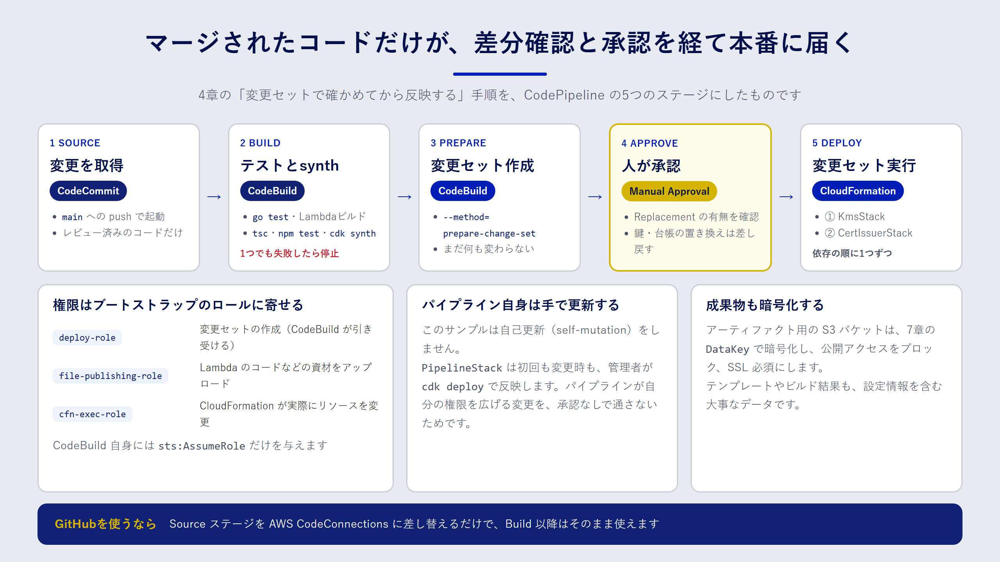

## この章で分かること

- CodeCommit・CodeBuild・CodePipeline の役割分担
- テスト、変更セット、人の承認を経てデプロイするパイプラインの作り方
- パイプラインに渡す権限を、CDK のブートストラップ資材で絞る方法

## なぜパイプラインでデプロイするのか

ここまでの章では、`cdk deploy` を手元のパソコンから実行してきました。一人で試すうちはこれで十分ですが、チームで本番環境を扱うようになると、次のような問題が出てきます。

- 誰の手元で、どのバージョンのコードからデプロイしたのかが分からない
- テストを飛ばしたデプロイや、レビュー前のデプロイを止められない
- 開発者一人ひとりに、本番環境を変更できる強い権限を配る必要がある

**CI/CD パイプライン** を使うと、「リポジトリにマージされたコードだけが、決まった手順を通って本番に届く」状態を作れます。デプロイの権限はパイプラインだけが持てばよく、開発者は本番の変更権限を持たずに済みます。

## Code シリーズの役割分担

AWS には、CI/CD のためのサービスが「Code」で始まる名前でそろっています。この章で使うのは次の三つです。

| サービス | 役割 | この章での使い方 |
| --- | --- | --- |
| AWS CodeCommit | Git リポジトリ | `samples/` の中身をそのまま置くリポジトリ |
| AWS CodeBuild | ビルドとテストの実行環境 | テスト、Lambda のビルド、`cdk synth`、変更セットの作成 |
| AWS CodePipeline | 全体の流れを管理する | ソース取得から承認、デプロイまでの順番を決める |

:::message
CodeCommit は、2024年7月に新規利用の受け付けを停止しましたが、2025年11月に一般提供へ戻り、新規の利用者も再び使えるようになりました。サービスの提供状況は変わることがあるので、使いはじめる前に公式の情報を確認してください（本書の記述は2026年9月時点）。GitHub などを使う場合は、この章の最後で紹介する AWS CodeConnections でソースを差し替えられます。
:::

## この章で作るパイプライン



サンプルの `PipelineStack` は、次の五つのステージでできています。

1. **Source**：CodeCommit の `main` ブランチに変更が入ると、パイプラインが動きはじめます。
2. **Build**：CodeBuild で Go のテストと Lambda のビルド、CDK の型チェックとテスト、`cdk synth` を実行します。どれか一つでも失敗すれば、ここで止まります。
3. **PrepareChangeSet**：`Build` の成果物（`cdk.out`）を使って、`KmsStack` と `CertIssuerStack` の変更セットを作ります。この時点では、まだ何も変更されません。
4. **Approve**：人が変更セットの中身を確認して、承認します。
5. **Deploy**：承認された変更セットを、`KmsStack` → `CertIssuerStack` の順に実行します。

4章で学んだ「変更セットで差分を確かめてから反映する」という手順を、そのままパイプラインにしたものです。人が確認するのは、コードの差分だけではありません。変更セットには「どのリソースが置き換え（Replacement）になるか」が表示されるので、鍵や台帳テーブルが作り直されるような危険な変更に気づけます。

### リポジトリの構成

リポジトリには、`samples/` ディレクトリの中身をそのまま置く前提です。

```text:リポジトリの構成
.
├── cdk/        # CDK アプリ（bin, lib, test）
├── lambda/     # Go の Lambda
├── scripts/    # build-lambda.sh
└── cfn/        # 4章・7章の CloudFormation テンプレート
```

## CDK でパイプラインを書く

### アーティファクト用のバケット

CodePipeline は、ステージの間で受け渡すファイル（アーティファクト）を S3 に置きます。テンプレートやビルド結果には設定の情報が含まれるので、アーティファクト用のバケットも保護します。

```ts:samples/cdk/lib/pipeline-stack.ts（抜粋）
const artifactBucket = new s3.Bucket(this, "ArtifactBucket", {
  blockPublicAccess: s3.BlockPublicAccess.BLOCK_ALL,
  enforceSSL: true,
  encryptionKey: props.artifactKey, // 7章の DataKey で SSE-KMS 暗号化
  removalPolicy: cdk.RemovalPolicy.DESTROY,
  autoDeleteObjects: true,
});
```

アーティファクトは、パイプラインを実行するたびに作り直せる一時的なデータです。そのため、鍵や台帳とは違い、スタックと一緒に削除する `DESTROY` にしています。何を `RETAIN` にし、何を `DESTROY` にするかは、「失ったら取り戻せるか」で決めましょう。

### テストと synth を実行する CodeBuild

CodeBuild の処理内容は、**buildspec** と呼ばれる設定で書きます。サンプルでは、CDK のコードの中に buildspec を書いています。

```ts:samples/cdk/lib/pipeline-stack.ts（抜粋）
const buildProject = new codebuild.PipelineProject(this, "BuildProject", {
  environment: { buildImage: codebuild.LinuxBuildImage.AMAZON_LINUX_2023_5 },
  buildSpec: codebuild.BuildSpec.fromObject({
    version: "0.2",
    phases: {
      install: {
        "runtime-versions": { nodejs: "22", golang: "1.25" },
        commands: ["npm ci --prefix cdk"],
      },
      build: {
        commands: [
          "bash scripts/build-lambda.sh",
          "cd cdk && npx tsc --noEmit && npm test && npx cdk synth",
        ],
      },
    },
    artifacts: {
      files: ["cdk/cdk.out/**/*", "cdk/package.json", "cdk/package-lock.json"],
    },
  }),
});
```

`npm ci` は、`package-lock.json` に書かれたバージョンのとおりに依存パッケージを入れるコマンドです。手元と CodeBuild で同じバージョンが使われるので、「手元では動いたのに」を防げます。

:::message
CodeBuild で使えるランタイムのバージョンは、ビルドイメージごとに決まっています。上の `nodejs: "22"` や `golang: "1.25"` が使えるかは、CodeBuild のドキュメントにある「利用可能なランタイム」の一覧で確認してください。イメージが更新されると、使えるバージョンも変わります。
:::

### 変更セットを作る

変更セットの作成には、CDK CLI の `--method=prepare-change-set` を使います。変更セットを作るところで止まり、実行はしません。

```bash:PrepareChangeSet の CodeBuild で実行するコマンド
npm ci --prefix cdk
cd cdk && npx cdk deploy --app cdk.out KmsStack CertIssuerStack \
  --method=prepare-change-set --change-set-name iac-book-pipeline \
  --require-approval never
```

`--app cdk.out` は、`Build` ステージで合成済みのテンプレートをそのまま使う指定です。もう一度 synth し直さないので、テストしたテンプレートと、変更セットにするテンプレートが確実に一致します。`--require-approval never` は、CDK CLI が IAM の変更について確認を求めるプロンプトを出さないための指定です。人による確認は、次の承認ステージで行います。

### 承認と実行

```ts:samples/cdk/lib/pipeline-stack.ts（抜粋）
{
  stageName: "Approve",
  actions: [new cpactions.ManualApprovalAction({ actionName: "ApproveChangeSet" })],
},
{
  stageName: "Deploy",
  actions: DEPLOY_STACKS.map(
    (stackName, i) =>
      new cpactions.CloudFormationExecuteChangeSetAction({
        actionName: `Execute-${stackName}`,
        stackName,
        changeSetName: CHANGE_SET_NAME,
        runOrder: i + 1, // KmsStack → CertIssuerStack の順
      })
  ),
},
```

承認する人は、CloudFormation のコンソールで変更セットを開き、次の点を確かめます。

- `Replacement` が `True` や `Conditional` のリソースはないか（特に鍵、テーブル、バケット）
- IAM ポリシーやキーポリシーの変更が、意図したとおりか
- 変更が想定したスタックとリソースだけに収まっているか

問題があれば承認を拒否します。拒否するとパイプラインはそこで止まり、変更セットは実行されません。

`Deploy` ステージでは、`runOrder` で実行の順番を決めています。`CertIssuerStack` は `KmsStack` の鍵を参照しているので、同時ではなく順番に実行します。

:::message alert
スタックをまたぐ参照（エクスポートとインポート）を新しく追加するときは注意が必要です。変更セットは実行前にまとめて作るので、まだ存在しないエクスポートを参照する変更セットは、作成の段階で失敗することがあります。その場合は、参照される側（`KmsStack`）の変更だけを先にパイプラインに流し、次の実行で参照する側を変更します。
:::

## 権限をブートストラップ資材に寄せる

5章で紹介した `cdk bootstrap` は、デプロイに使う IAM ロールをアカウントに作ります。パイプラインでも、このロールを使います。

| ロール | 役割 |
| --- | --- |
| deploy ロール | 変更セットの作成や、スタックの状態の参照 |
| file-publishing ロール | Lambda のコードなどの資材を、ブートストラップ用のバケットに置く |
| CloudFormation 実行ロール | CloudFormation が、実際にリソースを作成・変更する |

`PrepareChangeSet` の CodeBuild には、deploy ロールと file-publishing ロールを引き受ける `sts:AssumeRole` だけを与えます。CodeBuild 自身に KMS や DynamoDB を操作する権限を与える必要はありません。

```ts:samples/cdk/lib/pipeline-stack.ts（抜粋）
prepareProject.addToRolePolicy(new iam.PolicyStatement({
  actions: ["sts:AssumeRole"],
  // ブートストラップが作るロール（cdk-hnb659fds-deploy-role-… など）だけに限定
  resources: [
    `arn:${this.partition}:iam::${this.account}:role/cdk-hnb659fds-*-${this.account}-${this.region}`,
  ],
}));
```

:::message
CloudFormation 実行ロールには、既定で管理者に近い強い権限が付きます。本番のアカウントでは、`cdk bootstrap --cloudformation-execution-policies` で、実行ロールに付けるポリシーを必要な範囲に絞ることを検討してください。
:::

## パイプライン自身の更新

CDK には、パイプラインが自分自身の定義も更新する「セルフミューテーション」の仕組み（CDK Pipelines）があります。便利な一方で、パイプラインの権限を広げる変更も、パイプライン自身が反映できてしまいます。

このサンプルは、学びやすさと安全性を優先して、セルフミューテーションを使いません。`PipelineStack` は、初回も変更時も、管理者が手元から反映します。

```bash:初回のデプロイ（管理者が実行）
cd samples/cdk
npx cdk deploy KmsStack PipelineStack
```

`PipelineStack` のデプロイ後、CodeCommit のリポジトリに `samples/` の中身を push すると、パイプラインが動きはじめます。

## GitHub をソースにする

ソースコードを GitHub や GitLab で管理している場合は、AWS CodeConnections を使います。コンソールで GitHub との接続（コネクション）を作って承認し、ソースステージのアクションを `CodeStarConnectionsSourceAction` に差し替えます。Build 以降のステージは、そのまま使えます。

## コストの目安

CodePipeline V2 は、アクションの実行時間に応じた料金です。CodeBuild はビルドの実行時間、CodeCommit はユーザー数とストレージ量などに応じて課金されます。いずれも無料利用枠がある場合がありますが、料金体系は変わることがあります。使う前に、各サービスの料金ページで確認してください（2026年9月時点）。

## まとめ

- パイプラインを使うと、マージされたコードだけが決まった手順で本番に届きます。開発者に本番の変更権限を配らずに済みます。
- サンプルのパイプラインは、ソース取得、テストと synth、変更セットの作成、人の承認、変更セットの実行の五段階です。
- 承認では、変更セットの `Replacement` と、IAM・キーポリシーの変更を重点的に確かめます。
- CodeBuild の権限は、ブートストラップのロールを引き受ける `sts:AssumeRole` に絞ります。
- パイプライン自身の更新は、管理者が `cdk deploy` で行います。

## 確認問題

**問1.** `PrepareChangeSet` で `cdk synth` をやり直さず、`--app cdk.out` を使うのはなぜですか。

:::details 解答例
`Build` ステージでテストしたテンプレートと、変更セットにするテンプレートを確実に一致させるためです。synth をやり直すと、依存パッケージや環境の違いで、テストしていないテンプレートが生まれる可能性があります。
:::

**問2.** 承認者が変更セットを見て、`CertIssuerStack` の台帳テーブルの `Replacement` が `True` になっていることに気づきました。どうすべきですか。

:::details 解答例
承認を拒否して、パイプラインを止めます。置き換えになるとテーブルが新しく作られ、発行済み証明書の台帳が引き継がれません。論理 ID の変更や、置き換えが必要なプロパティの変更がないかをコードで確かめて、置き換えにならない方法に直します。
:::

**問3.** このサンプルが、パイプラインのセルフミューテーションを使わないのはなぜですか。

:::details 解答例
パイプラインが自分自身の権限を広げる変更も、承認なしで反映できてしまうのを避けるためです。`PipelineStack` の変更は管理者が手元で `cdk diff` を確かめてから `cdk deploy` するので、パイプラインの権限の変更を人が必ず確認できます。
:::
