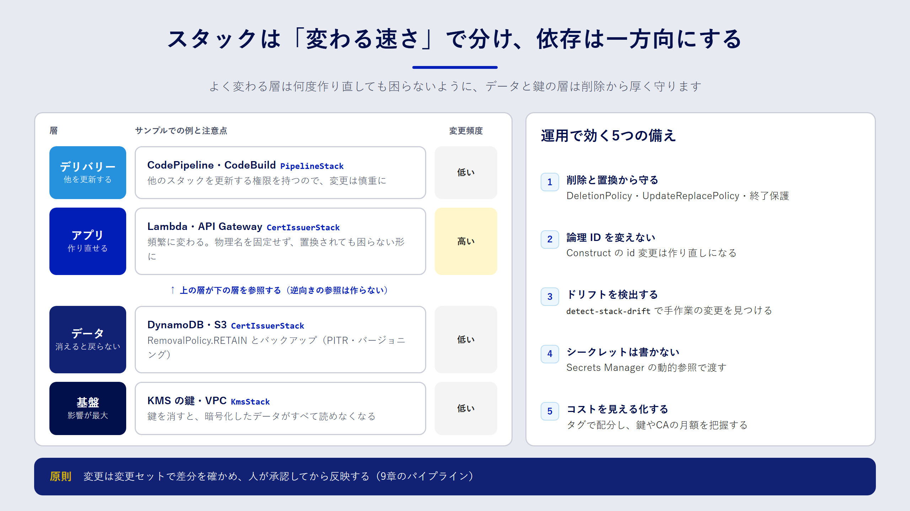

## この章で分かること

- スタックをどう分けると、変更の影響範囲を小さくできるのか
- データを持つリソースを、IaC の操作ミスから守る方法
- ドリフト、シークレット、コスト、CDK の論理 ID など、運用に入ってから効いてくる論点

## 作ってからが本番

IaC のコードは、一度書いたら終わりではありません。むしろ、何年も変更を重ねていく中で真価が問われます。運用が始まると、次のような悩みが出てきます。

- 小さな変更のつもりが、関係ないリソースまで差分に出てきて怖い
- リファクタリングしたら、データベースが作り直されそうになった
- 誰かがコンソールで設定を変えていて、デプロイが失敗した

この章では、こうした問題を設計の段階で減らすための勘所をまとめます。

## スタックの分け方

一つのスタックにすべてを詰め込むと、どんな小さな変更も全体の差分として扱われます。失敗したときのロールバックも全体に及びます。かといって細かく分けすぎると、スタック間の依存関係の管理が大変になります。

分けるときの軸は、**ライフサイクル**（変更の頻度と寿命）と **責任範囲**（誰が変更するか）の二つです。



| 層 | 例 | 変更頻度 | 注意点 |
| --- | --- | --- | --- |
| 基盤 | VPC、KMS の鍵 | 低い | 削除すると影響が大きい。保護を厚くする |
| データ | DynamoDB、S3、RDS | 低い | 置き換えでデータが消える。削除ポリシー必須 |
| アプリ | Lambda、API Gateway | 高い | 何度作り直しても困らない状態を保つ |
| デリバリー | CodePipeline | 低い | 他のスタックを更新する権限を持つので慎重に |

この本のサンプルも、この考え方で `KmsStack`（基盤）、`CertIssuerStack`（データとアプリ）、`PipelineStack`（デリバリー）に分けています。依存の向きは「アプリが基盤を参照する」の一方向にし、基盤がアプリを参照しないようにします。

### スタック間の参照に気をつける

CloudFormation では、あるスタックの出力を別のスタックが `Fn::ImportValue` で参照できます。CDK でも、スタックをまたいでオブジェクトを渡すと、この仕組みが自動で使われます。

ただし、参照されている出力は、参照している側が存在する限り変更も削除もできません。参照元のリソースを作り直したくても、先に参照している側を直す必要があり、手順が複雑になります。頻繁に変わる値は、SSM パラメータストアに書き込んで参照先で読む、あるいは ARN などの固定値をパラメータとして渡す、といった方法でゆるく結合するのも手です。

## データを持つリソースを守る

IaC で最も避けたい事故は、データを持つリソースの削除や置き換えです。CloudFormation には、これを防ぐための仕組みが複数あります。

| 仕組み | 守るもの | 設定例 |
| --- | --- | --- |
| `DeletionPolicy: Retain` | スタックからリソースを外したときや、スタックを削除したとき | テンプレートのリソースに付ける |
| `UpdateReplacePolicy: Retain` | 置き換えで古いリソースが削除されるとき | 同上 |
| 削除保護（termination protection） | スタックそのものの削除 | スタックの設定で有効にする |
| スタックポリシー | 特定リソースの更新・置き換え | スタックに JSON で設定する |

CDK では、`removalPolicy: RemovalPolicy.RETAIN` を指定すると、`DeletionPolicy` と `UpdateReplacePolicy` の両方に `Retain` が設定されます。KMS の鍵、DynamoDB テーブル、S3 バケットのように、中身を失うと取り返しがつかないリソースには必ず付けましょう。

:::message alert
`Retain` にしたリソースは、スタックを削除しても AWS 上に残り、料金も発生し続けます。検証が終わったら、残ったリソースを手動で片付ける手順も用意しておいてください。
:::

### 物理名を固定しない

`bucketName: 'my-app-data'` のように、リソースの名前（物理名）を固定すると、置き換えが必要な変更のときに困ります。CloudFormation は「新しいリソースを作ってから古いものを消す」順で置き換えるため、同じ名前のリソースを同時に二つ作れず、更新が失敗します。名前は CloudFormation に自動で付けさせ、必要な場所には出力やパラメータで渡すのが安全です。

## CDK の論理 ID を意識する

CloudFormation は、テンプレート内の **論理 ID** でリソースを識別します。論理 ID が変わると、CloudFormation は「古いリソースを消して、新しいリソースを作る」と解釈します。

CDK の論理 ID は、Construct のツリー上のパス（`new Bucket(this, 'Data')` の `'Data'` や、その親の ID）から自動で決まります。そのため、次のようなリファクタリングだけで論理 ID が変わってしまいます。

- Construct の ID を `'Data'` から `'DataBucket'` に変えた
- バケットを別の Construct の中に移動した

コードの見た目だけを整えたつもりが、データを持つリソースの置き換えにつながるわけです。対策は次のとおりです。

- デプロイ前に必ず `cdk diff` を見て、`[-]` と `[+]` の組み合わせ（置き換え）がないか確かめる
- データを持つリソースの Construct ID は、一度決めたら変えない
- どうしても変えるときは、`(bucket.node.defaultChild as CfnBucket).overrideLogicalId('DataXXXX')` で元の論理 ID を固定する

CloudFormation には、リソースを削除せずに論理 ID を変えたり、別のスタックへ移したりする「スタックのリファクタリング」機能もあります。大がかりな整理が必要になったら、公式ドキュメントで使い方を確認してください。

## ドリフトに備える

IaC を導入しても、緊急対応などでコンソールから設定を変えることはあり得ます。そうして生まれたコードと実環境のずれ（ドリフト）は、CloudFormation のドリフト検出で見つけられます。

```bash
aws cloudformation detect-stack-drift --stack-name CertIssuerStack
aws cloudformation describe-stack-resource-drifts \
  --stack-name CertIssuerStack \
  --stack-resource-drift-status-filters MODIFIED DELETED
```

ドリフトを見つけたら、「実環境の変更をコードに取り込む」か「コードの内容で上書きする」かを決めます。どちらにしても、最後はコードが正しい状態に戻すのが原則です。定期的にドリフト検出を実行し、結果を通知する仕組みを作っておくと安心です。

## シークレットを扱う

パスワードや API キーは、テンプレートやソースコードに直接書いてはいけません。Secrets Manager に保管し、テンプレートからは **動的参照** で読み込みます。

```yaml:動的参照の例
MasterUserPassword: '{{resolve:secretsmanager:app/db-credentials:SecretString:password}}'
```

CDK なら `SecretValue.secretsManager('app/db-credentials', { jsonField: 'password' })` と書けます。どちらの場合も、テンプレートに残るのは参照だけで、値そのものは含まれません。

:::message
Lambda 関数の環境変数も、コンソールやテンプレートから誰でも読めます。シークレットを環境変数に入れず、関数の実行時に Secrets Manager から取得するほうが安全です。
:::

## コストを見える化する

IaC でリソースを作るのは簡単です。簡単だからこそ、作ったまま忘れたリソースが料金を生み続けがちです。

- **タグを一括で付ける**：CDK では `Tags.of(app).add('Project', 'iac-book')` と書くと、アプリ内のタグ付け可能なリソースすべてにタグが付きます。請求コンソールでコスト配分タグとして有効にすると、タグ単位で料金を集計できます。
- **固定費のかかるリソースを把握する**：KMS のカスタマーマネージドキーは1本あたり月額 1 USD かかります（2026年9月確認）。AWS Private CA は汎用モードで CA 1つあたり月額 400 USD です。8章で Private CA ではなく KMS を CA の鍵に使う理由の一つがここにあります。
- **後片付けの手順もコードの一部と考える**：`Retain` にしたリソースの削除手順は、README に書いておきます。

## 変更を安全に届ける

最後に、日々の変更の流れについてです。この本では、次の流れを推奨しています。

1. プルリクエストでコードをレビューする
2. CI でテストと `cdk synth`、静的チェックを実行する
3. 変更セットを作成し、差分（特に置き換えと削除）を人が確認する
4. 承認してから変更セットを実行する

9章のパイプラインは、この流れをそのまま自動化したものです。手作業で `cdk deploy` を実行する場合でも、`--method=prepare-change-set` で変更セットだけを作り、中身を確認してから実行する習慣を付けておくと事故を減らせます。

## まとめ

- スタックはライフサイクルと責任範囲で分け、依存は一方向にします。
- データを持つリソースには `Retain` を付け、物理名は固定しないようにします。
- CDK では Construct の ID やツリーの位置で論理 ID が決まるため、リファクタリングで置き換えが起きないよう `cdk diff` で確認します。
- ドリフト検出、シークレットの動的参照、タグによるコスト管理を運用に組み込みます。

## 確認問題

**問1.** CDK でバケットを別の Construct の中に移動したところ、`cdk diff` にバケットの削除と作成が表示されました。なぜですか。どう対処しますか。

:::details 解答例
CDK の論理 ID は Construct ツリー上のパスから決まるため、移動によって論理 ID が変わり、CloudFormation が別のリソースとして扱ったからです。データを持つバケットなら移動をやめるか、`overrideLogicalId` で元の論理 ID を固定します。デプロイ前に `cdk diff` で気づけたこと自体が重要です。
:::

**問2.** DynamoDB テーブルの物理名をコードで固定しない方がよいのはなぜですか。

:::details 解答
置き換えが必要な変更（たとえばキーの変更）をしたとき、CloudFormation は新しいテーブルを作ってから古いテーブルを削除します。物理名が固定されていると、同じ名前のテーブルを同時に作れないため更新が失敗します。名前は自動で付けさせ、アプリには環境変数などで渡します。
:::

**問3.** データベースのパスワードをテンプレートに書かずに渡すには、どうすればよいですか。

:::details 解答例
Secrets Manager にパスワードを保管し、テンプレートからは `{{resolve:secretsmanager:...}}` の動的参照で読み込みます。CDK では `SecretValue.secretsManager()` を使います。テンプレートや Git の履歴には参照だけが残り、値は含まれません。
:::
