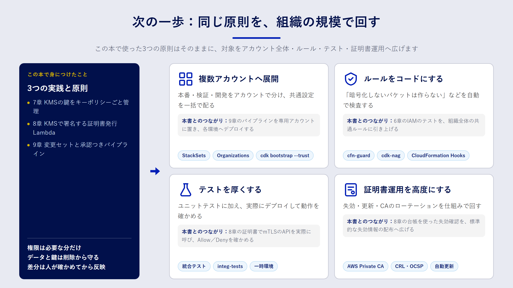

## この章で分かること

- この本で身につけたことの振り返り
- 実務で次に取り組むとよいテーマ
- 学び続けるための公式ドキュメント

## ふり返り

この本では、手作業の何が問題なのかという問いから出発し、CloudFormation と AWS CDK の書き方、IAM の考え方を学びました。そのうえで、三つの実践に取り組みました。

- **7章**：KMS の鍵を、管理者と利用者を分けたキーポリシーとともにコードで管理しました。
- **8章**：KMS の非対称キーを CA の鍵として使い、mTLS 用のクライアント証明書を発行する Lambda と、その証明書で認証する API を作りました。
- **9章**：CodeCommit・CodeBuild・CodePipeline を組み合わせ、テスト・変更セット・承認を経てデプロイするパイプラインを作りました。

三つに共通していたのは、「権限を必要な分だけに絞る」「データと鍵を削除から守る」「差分を人が確認してから反映する」という原則です。ツールが変わっても、この原則はそのまま使えます。

## 次に取り組むテーマ

### 複数アカウントへの展開

実務では、本番・検証・開発をアカウントで分けるのが一般的です。AWS Organizations でアカウントを束ね、IAM Identity Center で人のアクセスを一元管理します。IaC の観点では、次の二つが次の一歩になります。

- **CloudFormation StackSets**：同じテンプレートを複数のアカウント・リージョンに一括で展開します。監査用のロールやログ設定など、全アカウント共通の設定に向いています。
- **クロスアカウントのデプロイ**：パイプラインを専用のアカウントに置き、各環境のアカウントへデプロイします。CDK では `cdk bootstrap --trust` でパイプラインのアカウントを信頼させます。

### ポリシーのコード化

「暗号化されていないバケットを作らない」「`Resource: "*"` の IAM ポリシーを禁止する」といった組織のルールも、コードで表現できます。

- **AWS CloudFormation Guard（cfn-guard）**：テンプレートがルールに従っているかを検査する、ポリシー記述用の言語とツールです。
- **cdk-nag**：CDK アプリに組み込み、合成時にセキュリティのベストプラクティス違反を報告するライブラリです。

パイプラインのビルド段階に組み込めば、ルール違反をマージ前に止められます。

### テストの充実

この本では、合成されたテンプレートを検査するユニットテストを書きました。次の段階として、実際に一時的な環境へデプロイして動作を確かめる **統合テスト** があります。CDK には統合テスト用のモジュールも用意されています。デプロイと削除に時間と費用がかかるので、対象を絞って使いましょう。

### 証明書運用の高度化

8章の構成は、学習と小規模な運用を想定したものです。規模が大きくなったら、次の点を検討してください。

- **失効の即時反映**：API Gateway の mTLS は、証明書の失効を確認しません。8章では Lambda オーソライザーで台帳を確認しましたが、オーソライザーのキャッシュを有効にする場合は、失効が反映されるまでの時間を設計に含めます。
- **AWS Private CA への移行**：発行枚数が増えたり、監査要件で CA の運用記録が必要になったりしたら、マネージドの CA である AWS Private CA が選択肢になります。月額の固定費がかかるため、費用と運用負荷を比べて判断します。
- **中間 CA の導入**：ルート CA の鍵は使う機会を減らし、日々の発行は中間 CA で行う構成にすると、鍵が漏えいしたときの影響を抑えられます。

### GitHub との連携

9章では CodeCommit を使いましたが、ソースコードを GitHub で管理しているチームも多いでしょう。CodePipeline は、AWS CodeConnections を通じて GitHub や GitLab をソースとして使えます。パイプラインのソースステージを差し替えるだけで、ビルド以降はそのまま流用できます。

## 公式ドキュメント

学び続けるうえで、いちばん頼りになるのは公式ドキュメントです。日本語版が分かりにくいと感じたら、英語版と見比べてください。

| テーマ | ドキュメント |
| --- | --- |
| CloudFormation | [AWS CloudFormation ユーザーガイド](https://docs.aws.amazon.com/AWSCloudFormation/latest/UserGuide/Welcome.html) |
| AWS CDK | [AWS CDK v2 デベロッパーガイド](https://docs.aws.amazon.com/cdk/v2/guide/home.html) |
| IAM | [IAM ユーザーガイド：ポリシーの評価論理](https://docs.aws.amazon.com/IAM/latest/UserGuide/reference_policies_evaluation-logic.html) |
| KMS | [AWS KMS デベロッパーガイド：キーポリシー](https://docs.aws.amazon.com/kms/latest/developerguide/key-policies.html) |
| API Gateway の mTLS | [REST API の相互 TLS 認証](https://docs.aws.amazon.com/apigateway/latest/developerguide/rest-api-mutual-tls.html) |
| CodePipeline | [AWS CodePipeline ユーザーガイド](https://docs.aws.amazon.com/codepipeline/latest/userguide/welcome.html) |

## おわりに

IaC は、一度にすべてを置き換える必要はありません。まずは新しく作るリソースからコードで書き、差分を確認してから反映する習慣を付けるところから始めてみてください。コードに書かれたインフラは、チームの誰もが読み、直し、次の人に引き継げる資産になります。

## まとめ

- 三つの実践に共通する原則は、権限を絞る、データと鍵を守る、差分を確認してから反映する、の三つです。
- 次のテーマとして、複数アカウントへの展開、ポリシーのコード化、統合テスト、証明書運用の高度化、GitHub との連携があります。
- 迷ったら、公式ドキュメントの英語版と日本語版を見比べながら確認しましょう。

## 確認問題

**問1.** 8章の証明書発行の構成で、規模が大きくなったときに AWS Private CA への移行を検討する理由を説明してください。

:::details 解答例
発行枚数の増加や監査要件に対応するためです。AWS Private CA は、CA の鍵の保護、失効情報（CRL や OCSP）の提供、監査レポートなどをマネージドで提供します。自前の構成で同じことを実現するには、実装と運用の負担が大きくなります。ただし月額の固定費がかかるため、費用と比べて判断します。
:::

**問2.** 組織のセキュリティルールを「マージ前に」止めるには、どんな仕組みを使えばよいですか。

:::details 解答例
cfn-guard や cdk-nag でルールをコード化し、パイプラインのビルド段階やプルリクエストの CI で実行します。違反があればビルドが失敗するので、ルールに反する変更が本番環境に届く前に止められます。
:::
